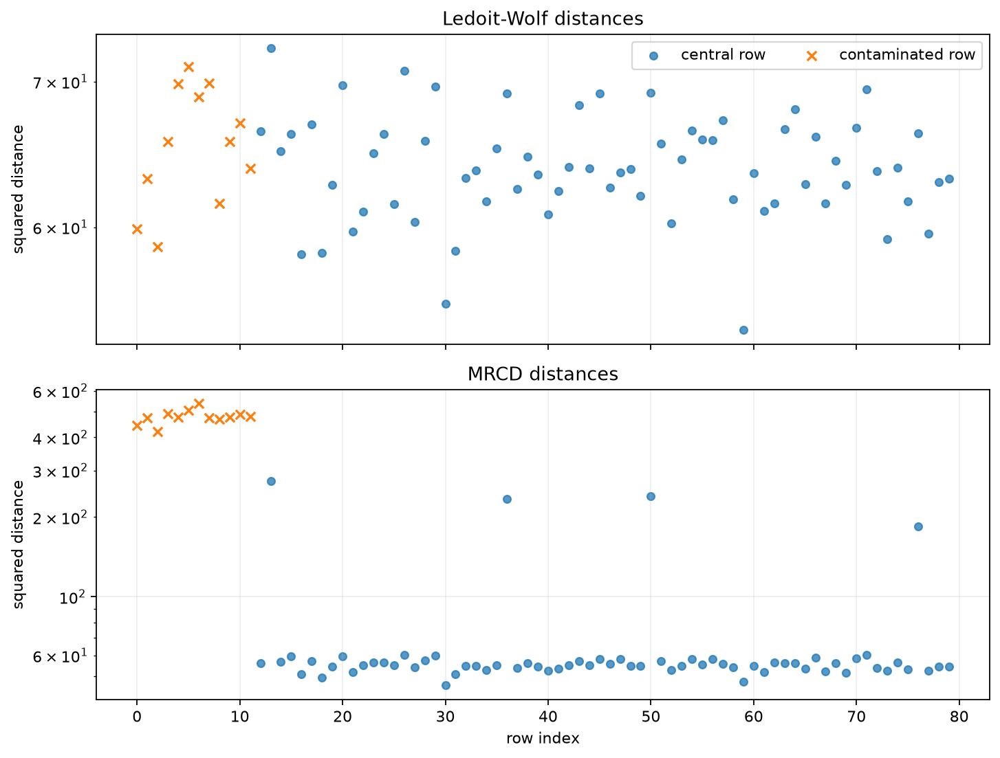
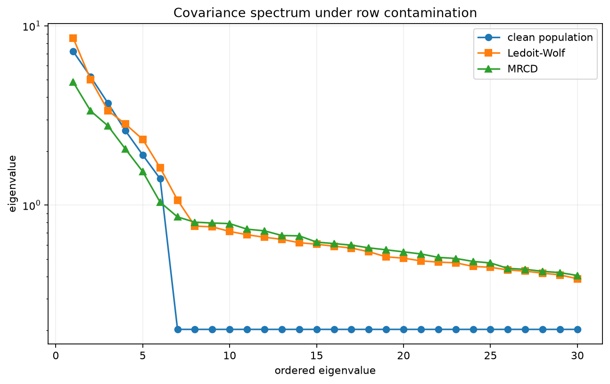
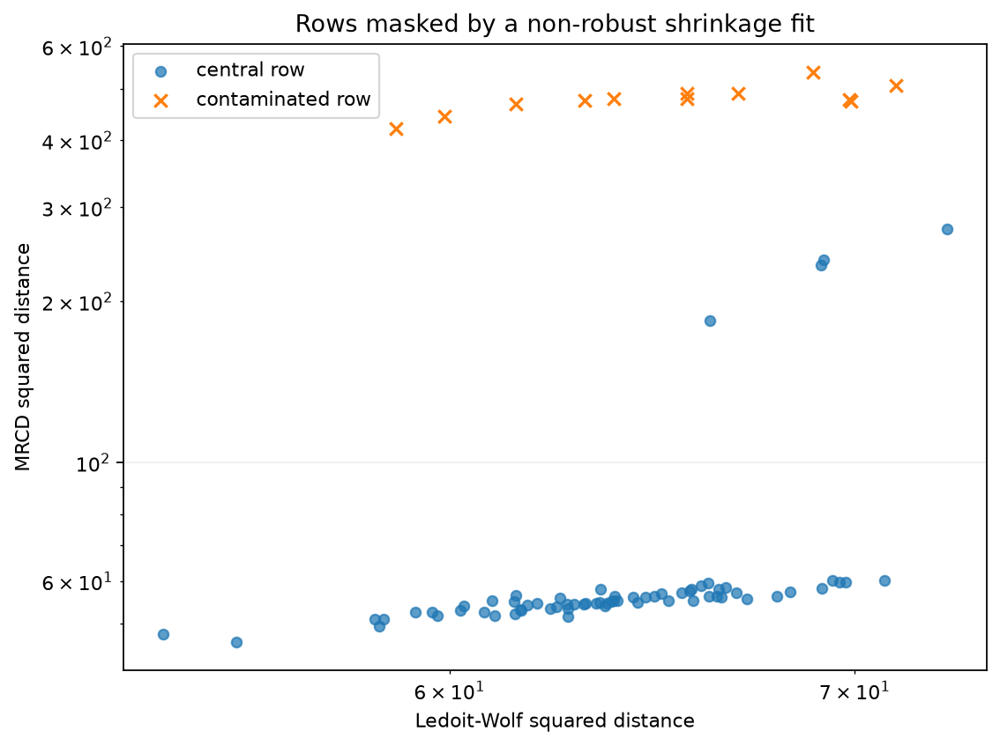

MRCD when the feature count exceeds the sample size
===================================================

This example has 80 observations and 120 correlated features.  The clean data
come from a six-factor model, and twelve rows are displaced in a direction with
little natural variance.  That is a difficult configuration for ordinary
covariance estimates: the empirical covariance is singular, while a shrinkage
estimate fitted to every row can absorb part of the contamination.

The comparison uses Ledoit--Wolf covariance as a non-robust high-dimensional
baseline.  ``MRCD`` keeps a subset of the rows and regularizes its covariance
toward a diagonal target.  The target weight is selected automatically so the
covariance in robustly standardized coordinates stays well conditioned.

Run the example
---------------

.. code-block:: bash

   python examples/plot_mrcd_high_dimensional_outliers.py

.. literalinclude:: ../_static/gallery/mrcd_high_dimensional_outliers/output.txt
   :language: text
   :caption: Console output

Distance comparison
-------------------

The top panel shows distances from the non-robust shrinkage fit.  The lower
panel uses MRCD.  In this simulation the contaminated rows are partly masked by
the all-row covariance but separate clearly under the robust subset fit.

Covariance spectrum
-------------------

The first part of the spectrum represents the six common factors.  The clean
population curve is available here because the data are simulated; in an
application it would not be known.

Masking crossplot
-----------------

Rows above the main cloud have much larger MRCD distance than Ledoit--Wolf
distance.  This is the masking pattern that motivates trimming before
regularization.

Practical limits
----------------

MRCD assumes rowwise contamination and an approximately elliptical central
population after scaling.  It does not identify isolated corrupted cells, and
the exact ``Qn`` marginal standardization used by default has quadratic cost in
the number of observations.  For very large row counts, ``standardization="mad"``
is cheaper.

Source
------

.. literalinclude:: ../../examples/plot_mrcd_high_dimensional_outliers.py
   :language: python
   :caption: examples/plot_mrcd_high_dimensional_outliers.py
