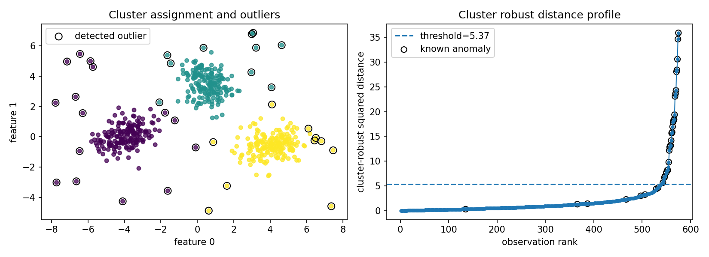
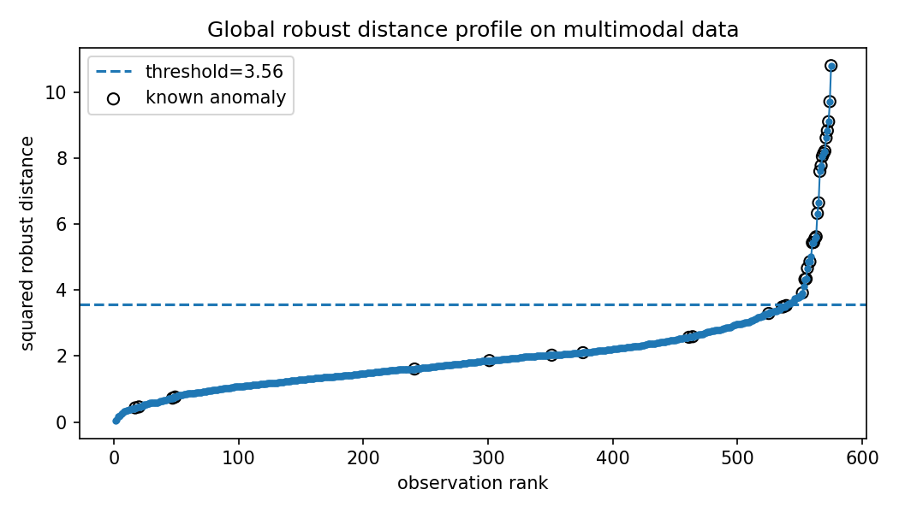

Multimodal anomaly detection
============================

A single robust covariance model assumes one main cloud.  Many real datasets have several legitimate modes: customer segments, operating regimes, embedding clusters, or image-feature groups.  In that setting, a global center can make valid small modes look suspicious.

Result at a glance
------------------

The cluster-aware detector improves F1 from 0.486 to 0.800 at the same detection budget.  That gap is the whole point of the example: the problem is not only robustness to outliers, but respecting multiple valid centers.

What the data represent
-----------------------

The example creates three valid two-dimensional modes and a small set of anomalies placed between and around those modes.

Why this estimator
------------------

``ClusterRobustOutlierDetector`` clusters first, then fits local robust scatter models.  It is a pragmatic diagnostic, not a full robust mixture model.

Reproduce the result
--------------------

.. code-block:: bash

   python examples/use_case_multimodal_anomaly.py

Output from the run
-------------------

.. literalinclude:: ../_static/gallery/multimodal_anomaly/output.txt
   :language: text

Figures and diagnostics
-----------------------

How to read the result
----------------------

The global profile answers “far from one global center?”; the cluster panel answers “far from the assigned local mode?”  For multimodal data, the second question is usually the useful one.

What this does not prove
------------------------

Use this when clusters are meaningful.  If clustering is unstable or arbitrary, compare several ``n_clusters`` values and inspect cluster stability before trusting the outlier list.
