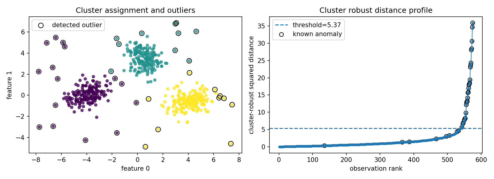
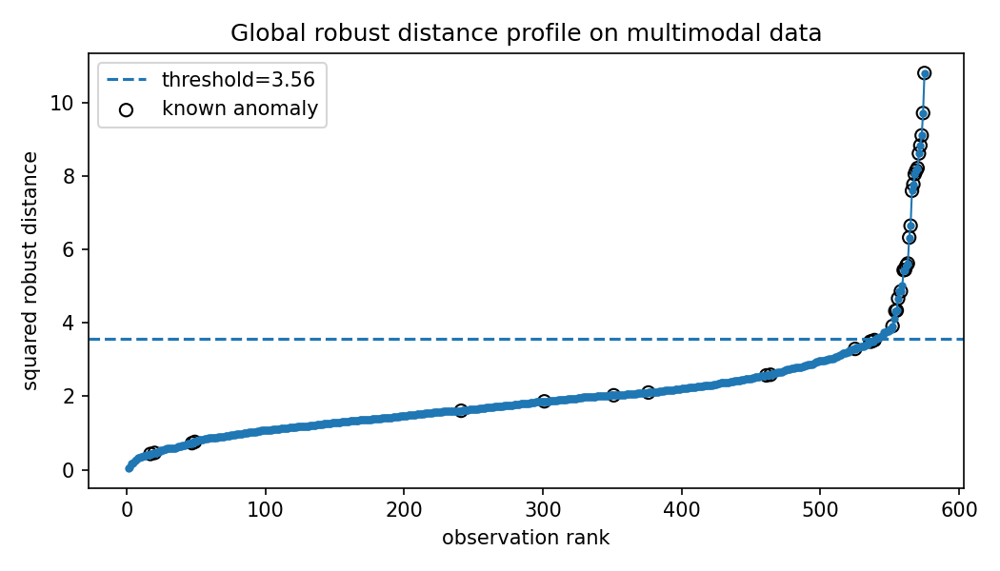

Multimodal anomaly detection
============================

A single robust covariance model assumes one main cloud.  Many real datasets have several legitimate modes: customer segments, operating regimes, embedding clusters, or image-feature groups.  In that setting, a global center can make valid small modes look suspicious.

Global versus local scoring
---------------------------

At the same detection budget, the cluster-aware detector raises F1 from 0.486 to 0.800.  A single global center treats some valid modes as unusual; local robust fits avoid that mismatch.

Three-mode simulation
---------------------

The example creates three valid two-dimensional modes and a small set of anomalies placed between and around those modes.

Local robust scatter
--------------------

``ClusterRobustOutlierDetector`` first assigns observations to clusters and then fits a robust scatter model inside each cluster.  It is a two-stage diagnostic rather than a jointly fitted robust mixture model.

Run the example
---------------

.. code-block:: bash

   python examples/use_case_multimodal_anomaly.py

Console output
--------------

.. literalinclude:: ../_static/gallery/multimodal_anomaly/output.txt
   :language: text

Plots
-----

Choosing the right reference center
-----------------------------------

The global profile answers “far from one global center?”; the cluster panel answers “far from the assigned local mode?”  For multimodal data, the second question is usually the useful one.

Cluster stability
-----------------

Use this when clusters are meaningful.  If clustering is unstable or arbitrary, compare several ``n_clusters`` values and inspect cluster stability before trusting the outlier list.
