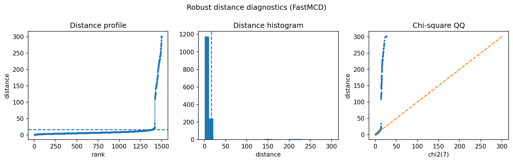

Network-traffic anomaly simulation
==================================

Network monitoring has the same geometry as many industrial anomaly problems: normal flows occupy a stable multivariate region, while attacks or unusual sessions produce atypical combinations of rates, counts, and durations.

Result at a glance
------------------

In the lightweight simulation, FastMCD detects the injected anomalous flows with precision and recall equal to 1.000.  The robust-distance plot gives a clean separation between normal traffic and the injected tail.

What the data represent
-----------------------

The bundled example is synthetic and intentionally simple.  It is meant to show the workflow, not to claim that every network-intrusion dataset is a rare-anomaly problem.

Why this estimator
------------------

``FastMCD`` is used when there is a dominant normal traffic regime.  For multimodal traffic or many attack classes, cluster-aware diagnostics or supervised baselines may be more appropriate.

Reproduce the result
--------------------

.. code-block:: bash

   python examples/use_case_network_traffic.py

Output from the run
-------------------

.. literalinclude:: ../_static/gallery/network_traffic/output.txt
   :language: text

Figures and diagnostics
-----------------------

How to read the result
----------------------

Use the distance panel to inspect whether anomalies form a distinct tail.  If normal traffic has several modes, a global covariance model may over-flag legitimate regimes.

What this does not prove
------------------------

Some popular intrusion datasets have very high attack fractions and are closer to classification than anomaly detection.  Those should not be highlighted as rare-anomaly wins.
