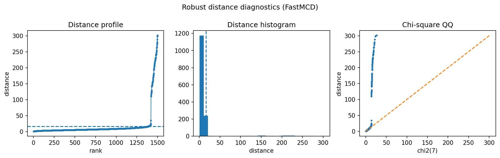

:orphan:

Network-traffic anomaly simulation
==================================

Network monitoring has the same geometry as many industrial anomaly problems: normal flows occupy a stable multivariate region, while attacks or unusual sessions produce atypical combinations of rates, counts, and durations.

Detection result
----------------

FastMCD separates all injected anomalous flows in this lightweight simulation, giving precision and recall of 1.000.  The result is intentionally simple and is mainly a check of the scoring workflow.

Traffic simulation
------------------

The bundled example is synthetic and intentionally simple.  It is meant to show the workflow, not to claim that every network-intrusion dataset is a rare-anomaly problem.

Single-regime baseline
----------------------

``FastMCD`` is used when there is a dominant normal traffic regime.  For multimodal traffic or many attack classes, cluster-aware diagnostics or supervised baselines may be more appropriate.

Run the example
---------------

.. code-block:: bash

   python examples/use_case_network_traffic.py

Console output
--------------

.. literalinclude:: ../_static/gallery/network_traffic/output.txt
   :language: text

Distance plots
--------------

Checking separation
-------------------

Use the distance panel to inspect whether anomalies form a distinct tail.  If normal traffic has several modes, a global covariance model may over-flag legitimate regimes.

Limits of the simulation
------------------------

Many intrusion datasets contain several traffic regimes and a large attack fraction.  In those cases, supervised or cluster-aware comparisons are more informative than a rare-anomaly framing.
