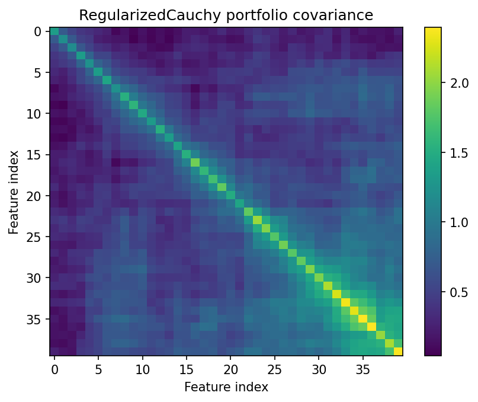
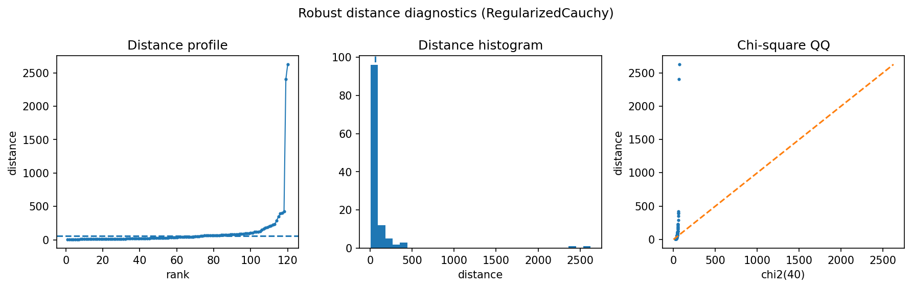

Portfolio covariance stress comparison
======================================

This example turns robust covariance into a simple portfolio-risk diagnostic.  Instead of asking only whether a day is anomalous, it asks how much an unstable covariance estimate can inflate risk estimates.

Result at a glance
------------------

The empirical covariance estimate produces much larger portfolio risk and a condition number around 1418.  The Cauchy-regularized estimate has lower risk, a condition number around 108, and a radial kurtosis around 5.84.

What the data represent
-----------------------

The example uses synthetic heavy-tailed asset returns with stress-like observations.  The goal is to show the effect of robust shrinkage on a covariance matrix used for risk measurement.

Why this estimator
------------------

``RegularizedCauchy`` is used because it is intentionally conservative under very heavy tails.  It downweights extreme radial observations while keeping the covariance invertible.

Reproduce the result
--------------------

.. code-block:: bash

   python examples/use_case_portfolio_stress.py

Output from the run
-------------------

.. literalinclude:: ../_static/gallery/portfolio_stress/output.txt
   :language: text

Figures and diagnostics
-----------------------

How to read the result
----------------------

Look first at the covariance heatmap and the condition number.  If the empirical estimate is dominated by stress observations, it can become numerically unstable and exaggerate risk in directions that are mostly noise.

What this does not prove
------------------------

This is a covariance/risk demonstration, not a full portfolio optimizer.  Real use should include out-of-sample risk and turnover checks.
