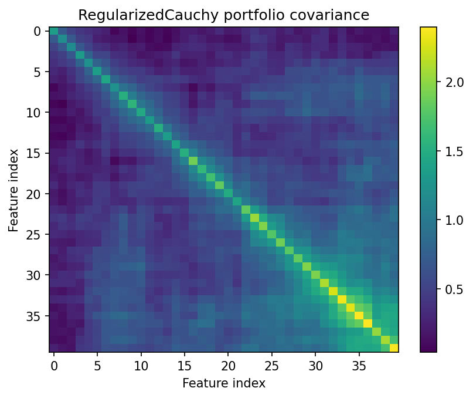
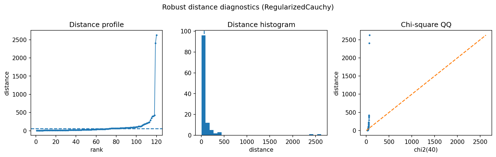

:orphan:

Portfolio covariance stress comparison
======================================

The example compares portfolio risk computed from empirical covariance with the same calculation based on a regularized robust estimate.  The focus is the sensitivity of the risk number to heavy-tailed observations.

Risk estimate under stress
--------------------------

The empirical covariance has a condition number near 1418 and produces a much larger risk estimate.  The Cauchy-regularized fit reduces the condition number to about 108 and has radial kurtosis near 5.84.

Return simulation
-----------------

The example uses synthetic heavy-tailed asset returns with stress-like observations.  The goal is to show the effect of robust shrinkage on a covariance matrix used for risk measurement.

Why regularized Cauchy scatter
------------------------------

``RegularizedCauchy`` is used because it is intentionally conservative under very heavy tails.  It downweights extreme radial observations while keeping the covariance invertible.

Run the example
---------------

.. code-block:: bash

   python examples/use_case_portfolio_stress.py

Console output
--------------

.. literalinclude:: ../_static/gallery/portfolio_stress/output.txt
   :language: text

Risk diagnostics
----------------

Conditioning and covariance structure
-------------------------------------

Look first at the covariance heatmap and the condition number.  If the empirical estimate is dominated by stress observations, it can become numerically unstable and exaggerate risk in directions that are mostly noise.

From covariance to portfolio decisions
--------------------------------------

The example stops at covariance-based risk.  Portfolio construction would also require out-of-sample forecasts, constraints, turnover, transaction costs, and sensitivity to the estimation window.
