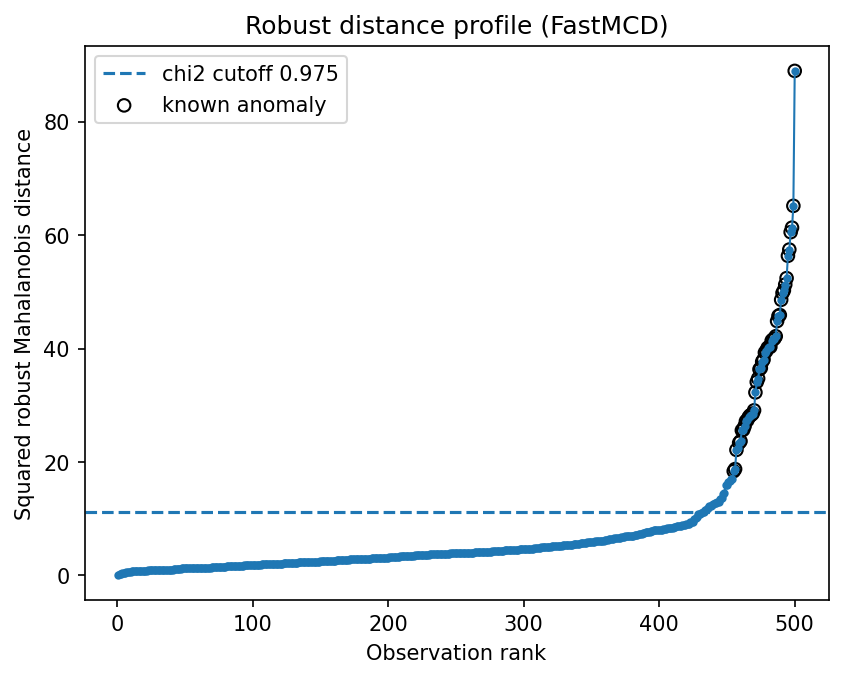
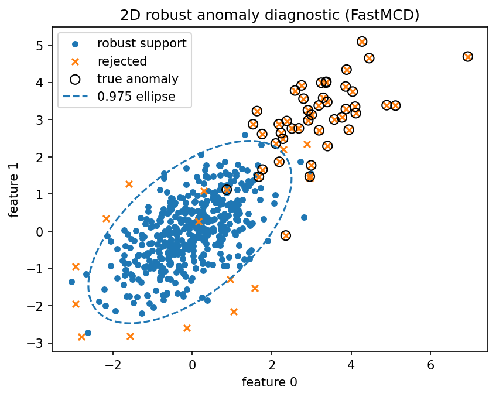

Quality-control monitoring
==========================

Quality-control problems often involve several measurements per item.  A part can look acceptable on every individual measurement but still be unusual in the joint feature space.

Result at a glance
------------------

The diagnostic report flags about 13.4% of observations at the chosen threshold and reports heavy-tail/QQ warnings.  This is an example where the recommendations are as important as the raw outlier labels.

What the data represent
-----------------------

The example simulates a small multivariate production process with abnormal items and heavy-tailed deviations.

Why this estimator
------------------

``FastMCD`` plus ``DiagnosticReport``.  The estimator gives robust distances; the report explains whether the threshold and covariance geometry look trustworthy.

Reproduce the result
--------------------

.. code-block:: bash

   python examples/use_case_quality_control.py

Output from the run
-------------------

.. literalinclude:: ../_static/gallery/quality_control/output.txt
   :language: text

Figures and diagnostics
-----------------------

How to read the result
----------------------

Start with the recommendations.  Here the report says the detected fraction is large and the tail deviates from Gaussian behavior, so empirical thresholds or a contamination prior are preferable to blind chi-square cutoffs.

What this does not prove
------------------------

Quality-control thresholds should be tied to inspection capacity, scrap cost, and historical defect labels.  The robust distance is a ranking signal, not a substitute for process knowledge.
