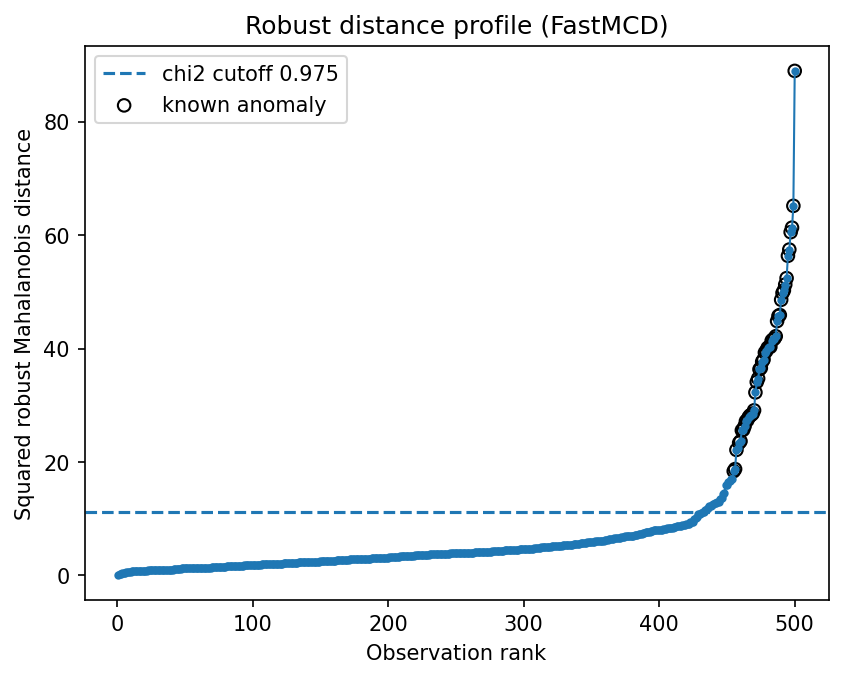
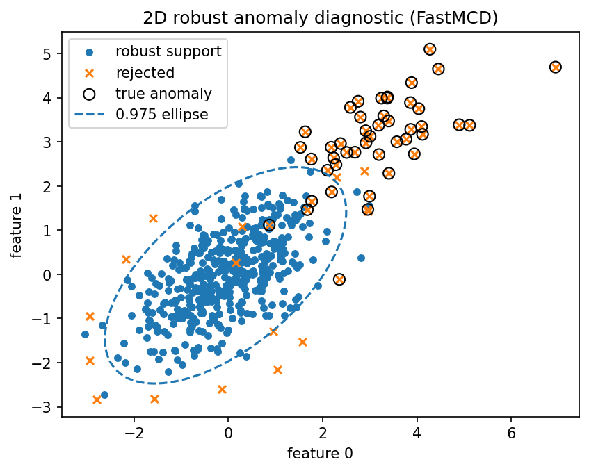

Quality-control monitoring
==========================

Quality-control problems often involve several measurements per item.  A part can look acceptable on every individual measurement but still be unusual in the joint feature space.

Diagnostic summary
------------------

At the chosen threshold, 13.4% of observations are flagged.  The report also warns about heavy tails and QQ deviation, which changes how the cutoff should be interpreted.

Production-process simulation
-----------------------------

The example simulates a small multivariate production process with abnormal items and heavy-tailed deviations.

Estimator and report
--------------------

``FastMCD`` provides the robust distances.  ``DiagnosticReport`` summarizes the fitted geometry and highlights conditions under which a chi-square threshold may be misleading.

Run the example
---------------

.. code-block:: bash

   python examples/use_case_quality_control.py

Console output
--------------

.. literalinclude:: ../_static/gallery/quality_control/output.txt
   :language: text

Plots
-----

Start with the warnings
-----------------------

Start with the recommendations.  Here the report says the detected fraction is large and the tail deviates from Gaussian behavior, so empirical thresholds or a contamination prior are preferable to blind chi-square cutoffs.

Setting inspection limits
-------------------------

Quality-control thresholds should be tied to inspection capacity, scrap cost, and historical defect labels.  The robust distance is a ranking signal, not a substitute for process knowledge.
