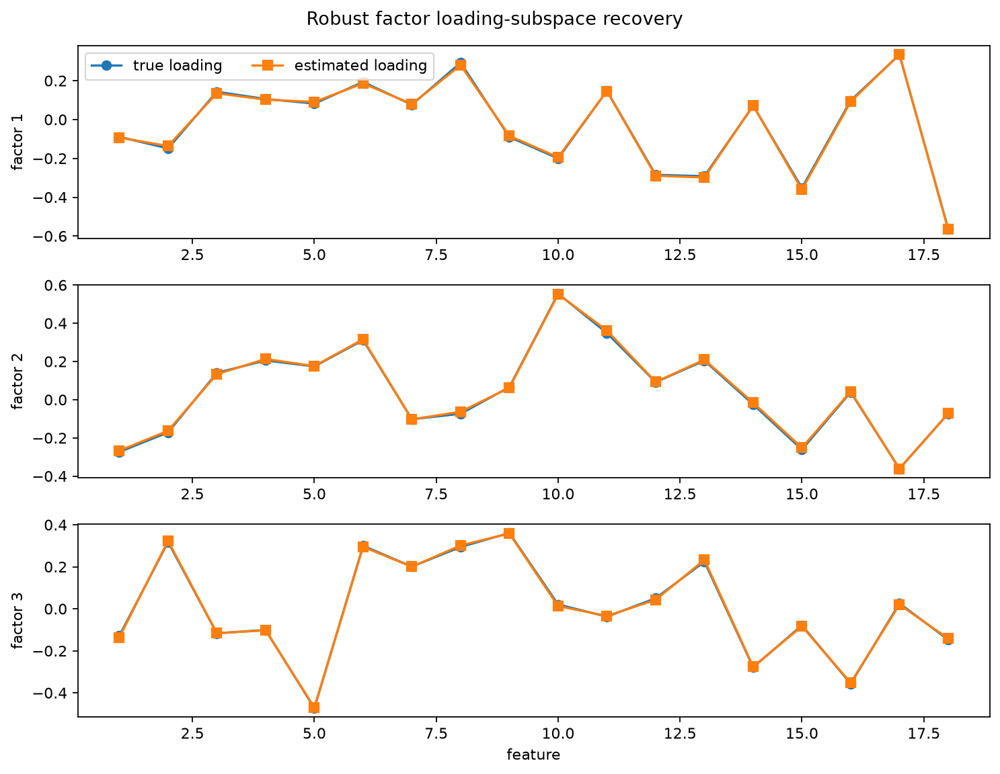
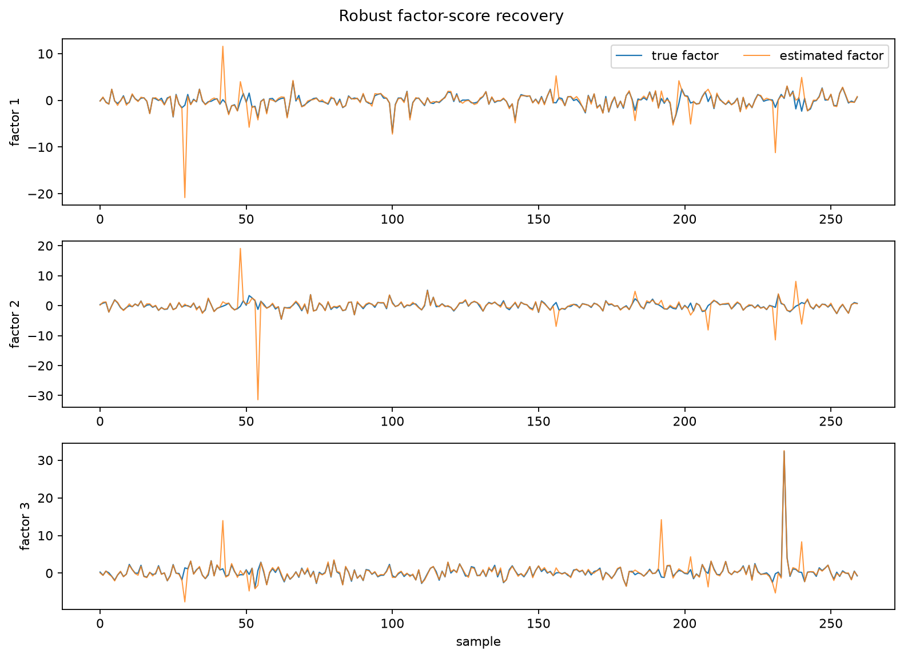
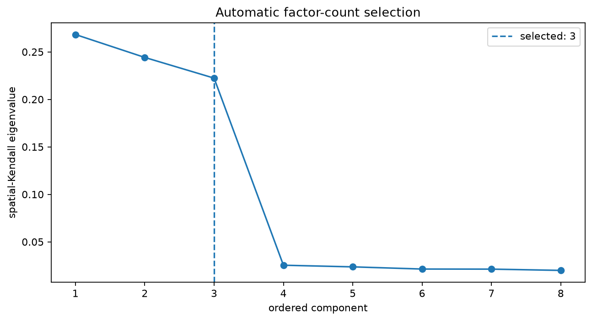

Robust static factor model
==========================

A static factor model decomposes a feature table into common low-rank movement
and idiosyncratic residuals.  ``RobustFactorModel`` uses a spatial-Kendall
loading subspace and can select the number of factors automatically.

Use this example when
---------------------

* many observed variables are driven by a small number of common factors;
* the sample is heavy-tailed or contains contaminated rows;
* you need explicit factor scores, loadings, common components, and residuals;
* a factor-model decomposition is more useful than PCA diagnostics alone.

Run the example
---------------

.. code-block:: bash

   python examples/robust_factor_model.py

.. literalinclude:: ../_static/gallery/robust_factor_model/output.txt
   :language: text
   :caption: Console output

Loading subspace
----------------

The estimated loading basis is orthogonally aligned to the known simulation
basis only for visualization.  Factor directions are otherwise identifiable up
to rotation.

Factor scores
-------------

Automatic factor-count selection
--------------------------------

The leading spatial-Kendall eigenvalues show the low-rank common structure and
the selected factor count.

The subspace error compares the fitted loading space with the known synthetic
factor space.  Factor directions remain identifiable only up to an invertible
rotation, so subspace recovery is more meaningful than an unaligned
column-by-column loading comparison.

Source
------

.. literalinclude:: ../../examples/robust_factor_model.py
   :language: python
   :caption: examples/robust_factor_model.py
