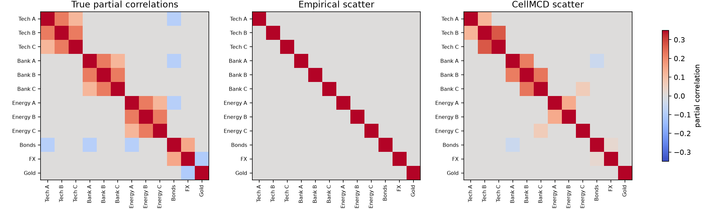
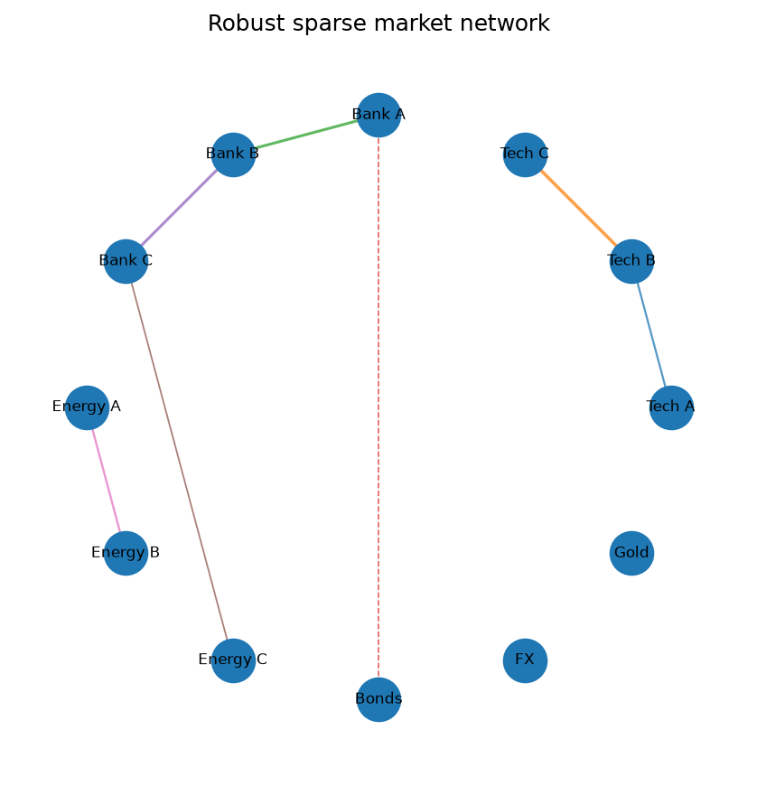
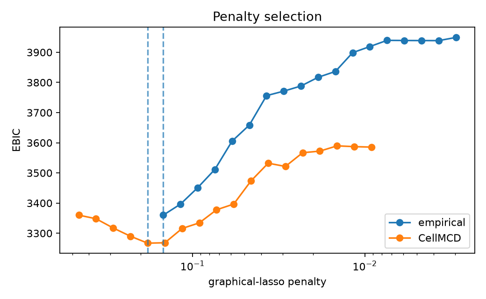

Sparse market network with bad ticks
====================================

The simulated data contain twelve correlated asset returns.  Their clean
precision matrix is sparse, so the true conditional-dependence network is
known.  Returns are heavy-tailed, 5.4% of individual cells are replaced by bad
ticks, and a small number of cells are missing.  Because the bad ticks are
spread across dates, roughly half of the rows contain at least one corrupted
entry.

Both models use the same graphical-lasso optimizer and EBIC rule.  The only
difference is the scatter matrix supplied to the optimizer:

* the baseline uses empirical covariance after median imputation;
* the robust fit uses ``CellMCD`` before sparse precision estimation.

Run the example
---------------

.. code-block:: bash

   python examples/plot_robust_graphical_lasso_market_network.py

.. literalinclude:: ../_static/gallery/robust_graphical_lasso_market_network/output.txt
   :language: text
   :caption: Console output

Recovered partial correlations
------------------------------

The empirical covariance is flattened by a relatively small number of extreme
cells, and EBIC consequently selects an empty graph.  The cellwise-robust fit
recovers much of the block and cross-asset structure.

Network view
------------

Solid edges indicate positive partial correlations; dashed edges indicate
negative partial correlations.  Edge width reflects absolute partial
correlation rather than marginal correlation.

Penalty path
------------

The vertical lines mark the penalties selected by EBIC.  A path is useful for
checking whether the chosen graph lies in a stable region or changes sharply
under a small penalty adjustment.

Scope
-----

The graph encodes conditional associations under the fitted elliptical/Gaussian
working model.  It does not establish causal links between assets.  The example
uses a known synthetic graph to measure edge recovery; real financial networks
also require temporal modeling, stability checks, and economic interpretation.

Source
------

.. literalinclude:: ../../examples/plot_robust_graphical_lasso_market_network.py
   :language: python
   :caption: examples/plot_robust_graphical_lasso_market_network.py
