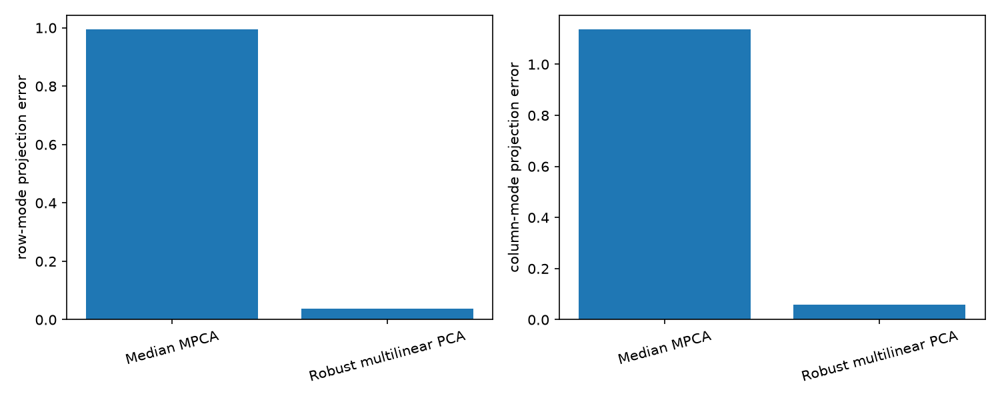
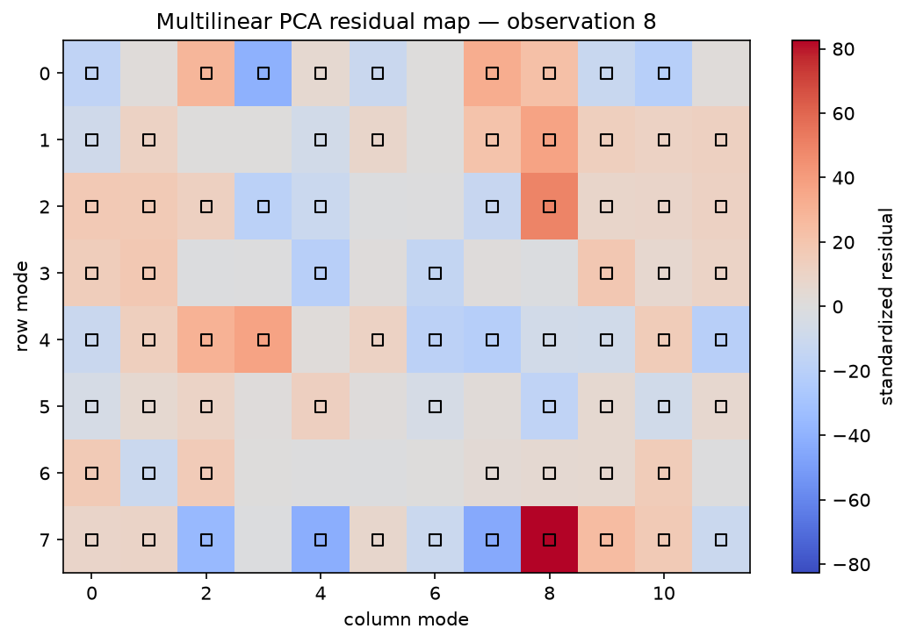
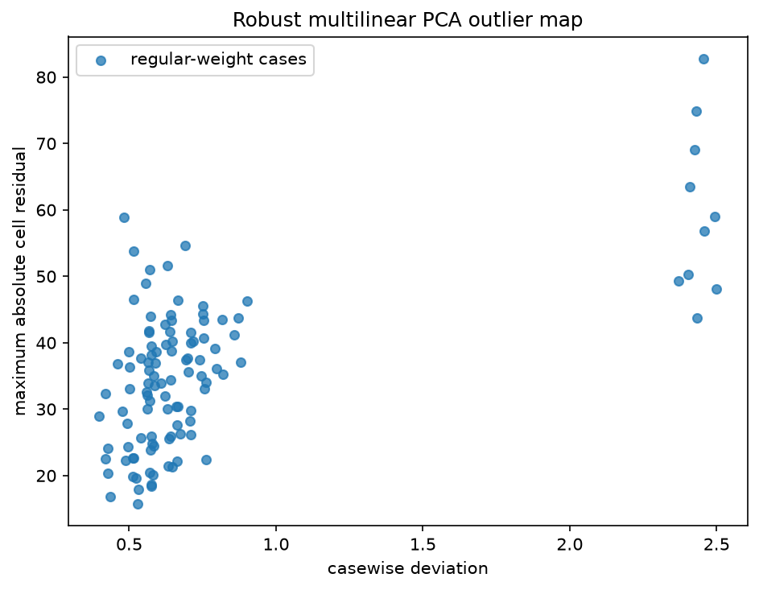
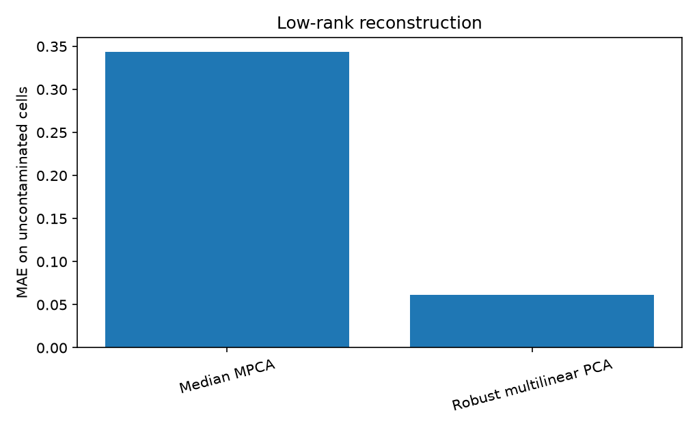

Robust multilinear PCA for sensor windows
=========================================

This example treats each observation as a sensor-by-time matrix.  The regular
windows follow a low-rank multilinear model, while some complete windows are
abnormal and other windows contain only a few damaged measurements.

A median-imputed multilinear PCA baseline is compared with
``RobustMultilinearPCA``.  The robust fit keeps the two modes separate, estimates
one loading matrix for sensors and one for time, and returns cell- and
case-level diagnostics.

.. literalinclude:: ../../examples/plot_robust_multilinear_pca.py
   :language: python
   :linenos:

Mode-subspace recovery
----------------------

Residual diagnostics
--------------------

Reconstruction
--------------

Captured output
---------------

.. literalinclude:: ../_static/gallery/robust_multilinear_pca/output.txt
   :language: text
