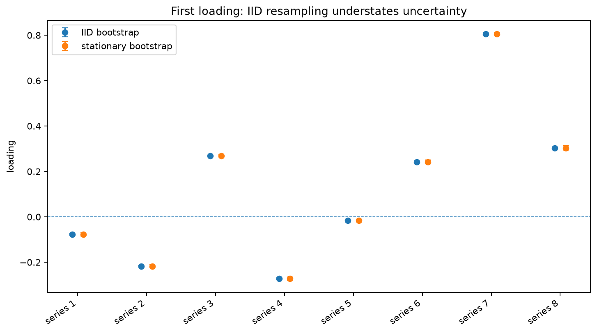
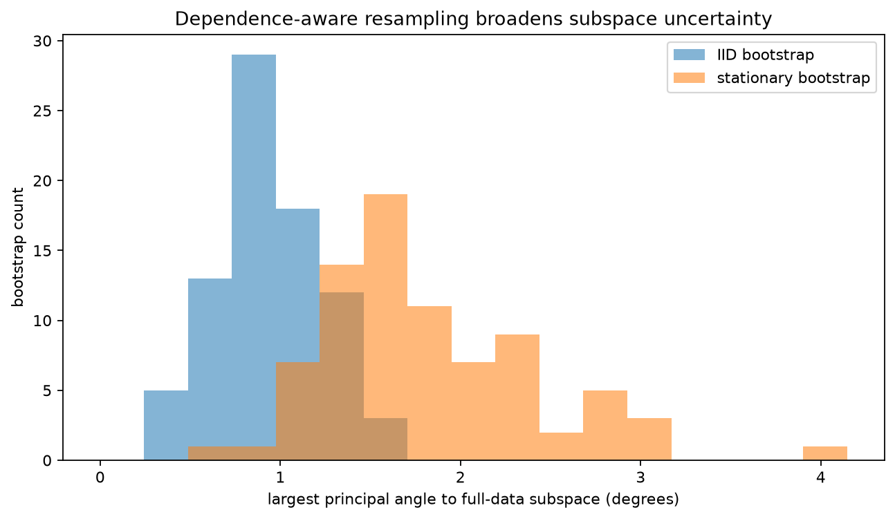
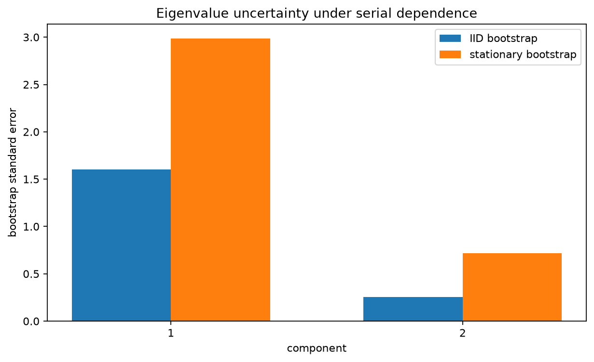

:orphan:

Dependent bootstrap stability for robust factors
================================================

Independent row resampling can be misleading when factor scores are persistent.
It breaks the runs of high and low values that determine the effective sample
size, so loading and eigenvalue intervals may be much narrower than the time
series warrants.

This example simulates an eight-variable process driven by two correlated,
heavy-tailed autoregressive factors.  The same ``RobustPCA`` estimator is
bootstrapped in two ways:

* IID rows sampled independently;
* stationary-bootstrap blocks with expected length 16.

The comparison isolates the effect of the resampling design.  The reference PCA
fit and the random seed are identical.

Run the example
---------------

.. code-block:: bash

   python examples/plot_robust_pca_dependent_stability.py

.. literalinclude:: ../_static/gallery/robust_pca_dependent_stability/output.txt
   :language: text
   :caption: Console output

Loading intervals
-----------------

The stationary bootstrap retains local serial dependence and produces wider
loading intervals.  The difference is not evidence that stationary bootstrap
is always conservative; it shows that the IID design was treating strongly
correlated rows as though each carried independent information.

Subspace angles
---------------

Principal angles measure movement of the complete retained subspace and do not
depend on component signs.  The dependence-aware bootstrap shows more
subspace variation because long runs in the factor scores are kept together.

Eigenvalue uncertainty
----------------------

The eigenvalues describe factor variance.  Their bootstrap standard errors are
also larger once serial dependence is retained.

Choosing the block length
-------------------------

The expected block length of 16 is known to be plausible for this simulation.
Real analyses should repeat the calculation over several block lengths or use a
data-driven selector suited to the statistic.  A short block approaches IID
sampling, while an excessively long block leaves too few effectively distinct
blocks.

The stationary bootstrap assumes a weakly dependent stationary series.  It is
not a remedy for trends, structural breaks, seasonality, or arbitrary
nonstationarity.  Those features should be modeled or handled before the
bootstrap design is interpreted.

Source
------

.. literalinclude:: ../../examples/plot_robust_pca_dependent_stability.py
   :language: python
   :caption: examples/plot_robust_pca_dependent_stability.py
