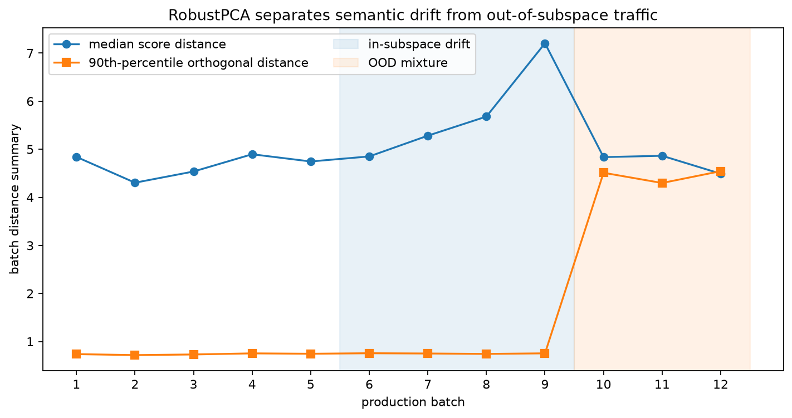
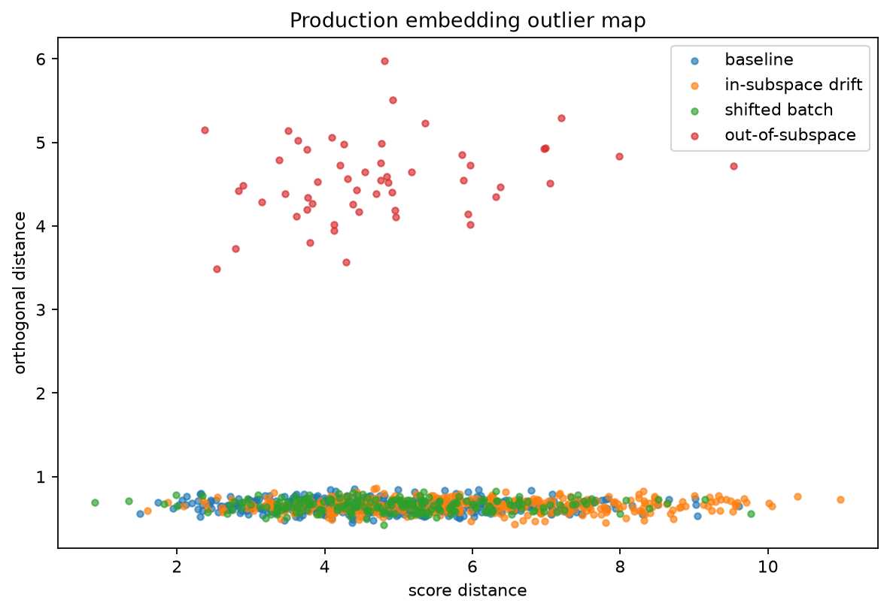
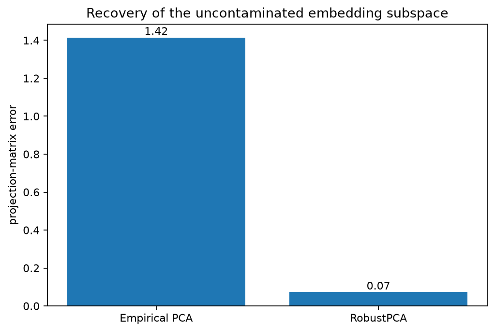

:orphan:

Monitoring production embeddings with RobustPCA
================================================

An embedding batch can change in two quite different ways.  The population may
move along directions already present in the reference data, or new vectors may
appear in directions that the reference subspace does not explain.  The first
case is ordinary drift; the second is often a stronger sign of OOD traffic,
broken preprocessing, or a serving mismatch.

Simulation
----------

The example generates 48-dimensional vectors from a six-dimensional latent
space.  A few corrupted vectors are added to the reference sample in a
direction orthogonal to the true latent space.  The production stream then
contains three kinds of batch:

* baseline traffic;
* gradual movement inside the latent space;
* a mixture in which 20% of the vectors leave that space.

``RegularizedCauchy`` is used for the robust fit because the feature dimension is
moderately large and the reference sample contains leverage-like contamination.
The regularization also keeps the scatter estimate well conditioned.

What to look for
----------------

The subspace-recovery plot compares empirical PCA with ``RobustPCA`` against the
known clean latent subspace.  The empirical fit is pulled toward the corrupted
reference direction, while the robust fit stays closer to the data-generating
subspace.

In the batch history, median score distance reacts to the gradual movement
inside the subspace.  The upper orthogonal-distance quantile remains quiet until
the OOD mixture arrives, because only part of that batch leaves the learned
representation space.

Run the example
---------------

.. code-block:: bash

   python examples/plot_robust_pca_embedding_monitoring.py

.. literalinclude:: ../_static/gallery/robust_pca_embedding_monitoring/output.txt
   :language: text
   :caption: Console output

Batch history
-------------

Outlier map for the final batch
-------------------------------

Subspace recovery
-----------------

Using this pattern in a service
-------------------------------

Fit and calibrate on a time-separated reference period rather than on the same
batches used to choose thresholds.  Production thresholds should also account
for seasonality, planned model-version changes, and known shifts in the input
population.  The synthetic values in this example are chosen to make the two
failure modes visible; they are not default operating thresholds.

Source
------

.. literalinclude:: ../../examples/plot_robust_pca_embedding_monitoring.py
   :language: python
   :caption: examples/plot_robust_pca_embedding_monitoring.py
