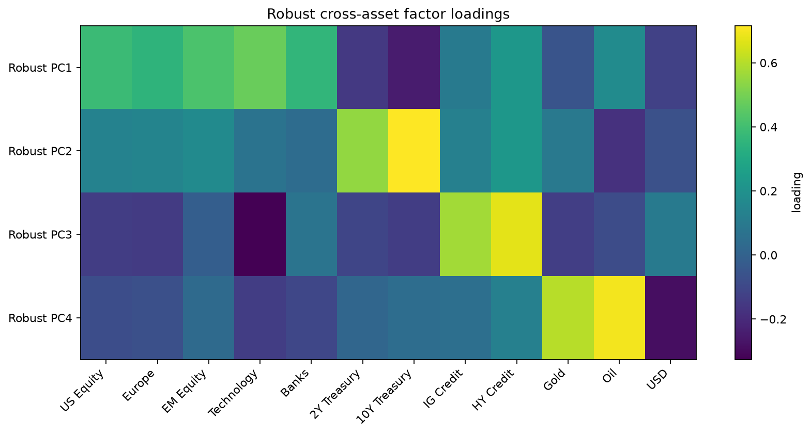
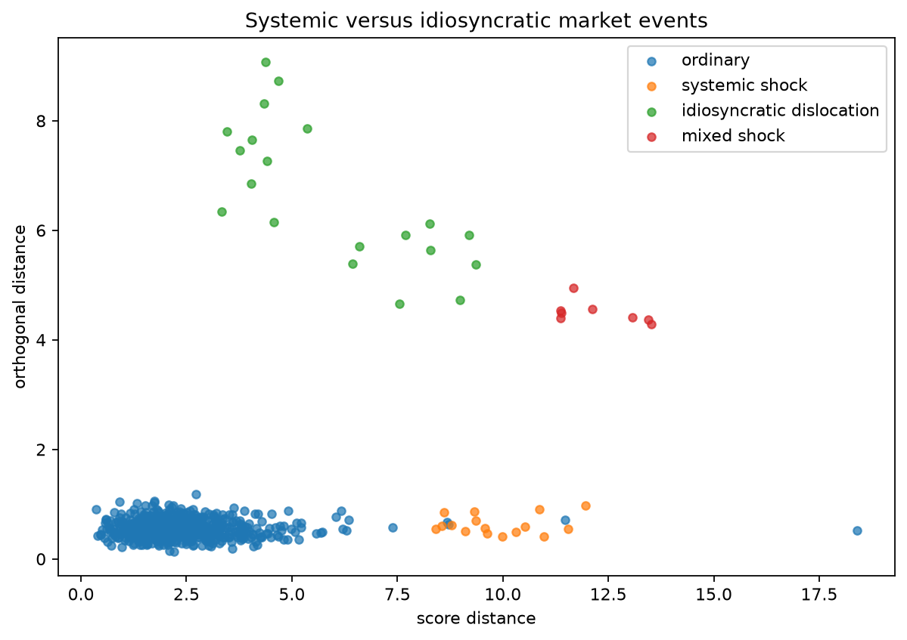
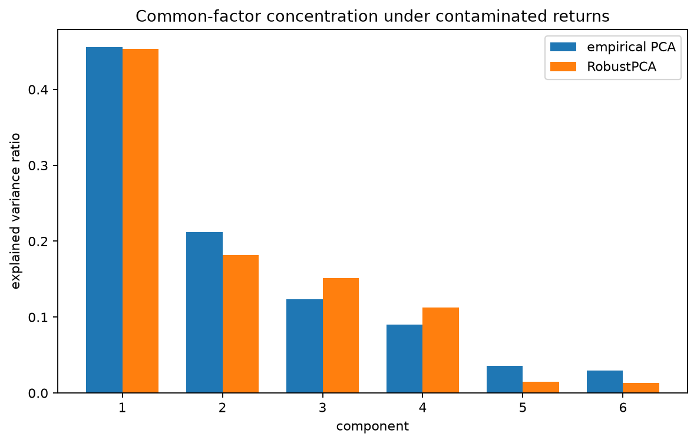
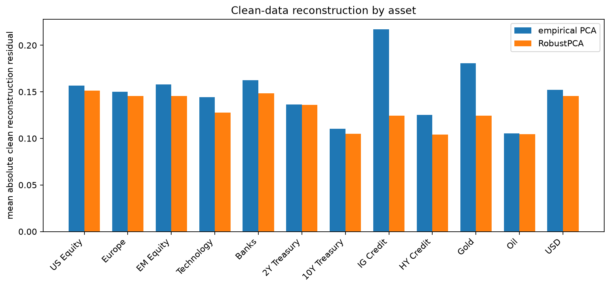

:orphan:

Separating broad market moves from instrument-specific shocks
==============================================================

A cross-asset factor model should treat a market-wide sell-off differently from
a jump in one instrument.  Both observations may be extreme, but only the
second falls outside the common structure used to summarize portfolio risk.

Synthetic market
----------------

The example simulates heavy-tailed returns for twelve assets across equities,
rates, credit, commodities, and the US dollar.  Four latent factors represent
broad growth, duration, credit, and inflation effects.  A small share of days is
then replaced by:

* common-factor stress;
* a large move in one asset;
* a mixture of systemic and idiosyncratic shocks.

``RegularizedCauchy`` downweights the most extreme radial observations while
shrinking the scatter estimate.  This is useful for heavy-tailed returns, where
large observations are expected but should not be allowed to define the entire
factor model.

Systemic and idiosyncratic movement
-----------------------------------

Score distance is large when a return vector is extreme along the fitted common
factors.  Orthogonal distance is large when the move cannot be reconstructed by
those factors.  A high orthogonal distance can therefore point to a sector
shock, corporate action, stale price, bad tick, or another event specific to a
small part of the cross-section.

The reconstruction-residual plot shows which assets remain difficult to explain
after the robust factors have been fitted.  The explained-variance plot and
loading heat map show how the empirical and robust decompositions differ under
contamination.

Run the example
---------------

.. code-block:: bash

   python examples/plot_robust_pca_market_risk.py

.. literalinclude:: ../_static/gallery/robust_pca_market_risk/output.txt
   :language: text
   :caption: Console output

Asset loadings
--------------

Outlier map
-----------

Explained variance
------------------

Residual by asset
-----------------

Before using this with portfolio data
-------------------------------------

Return construction, currency conversion, stale-price handling, corporate
actions, and time-varying volatility all affect the result.  A live risk model
also needs rolling backtests and regime analysis.  The example isolates the
subspace diagnostic; it does not cover forecasting, position sizing, or trading
costs.

Source
------

.. literalinclude:: ../../examples/plot_robust_pca_market_risk.py
   :language: python
   :caption: examples/plot_robust_pca_market_risk.py
