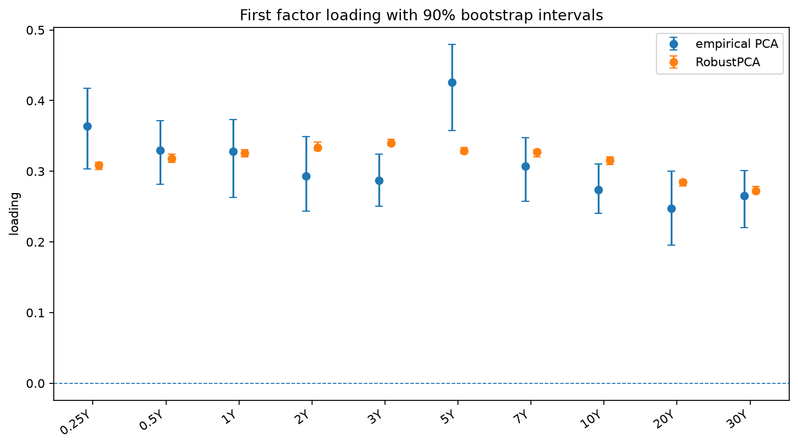
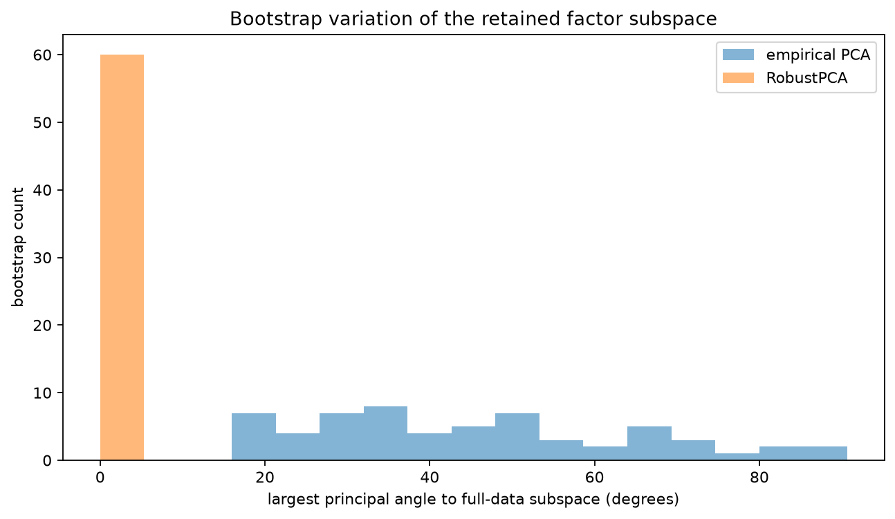
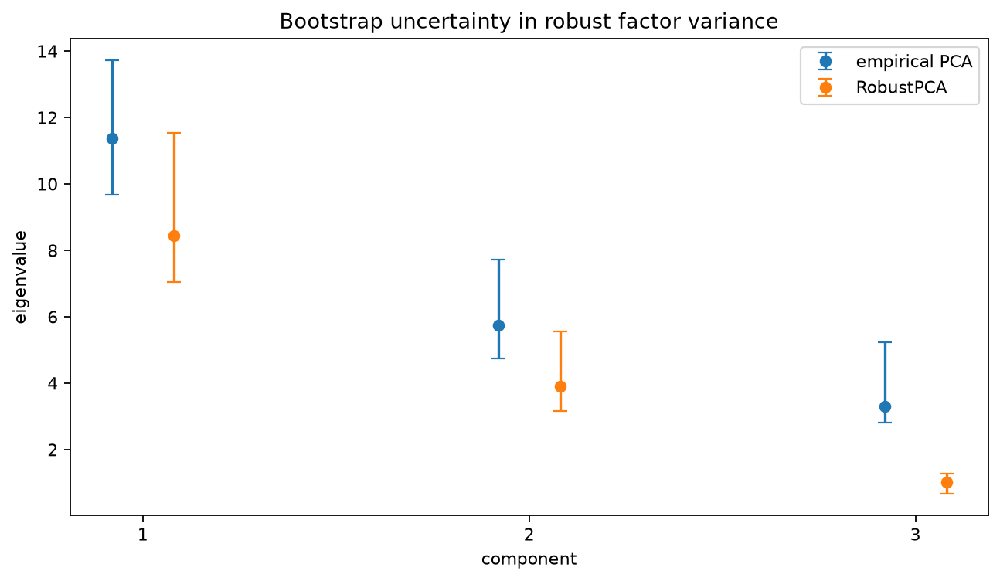

Bootstrap stability of yield-curve factors
===========================================

A yield-curve PCA fit is often interpreted through three factors.  The fitted
curves may look plausible even when a small group of quote errors makes those
factors unstable from one sample to another.

This example simulates daily changes at ten maturities.  Most observations come
from a three-factor level, slope, and curvature model.  Twenty-eight days also
contain large maturity-specific dislocations.  Ordinary PCA and ``RobustPCA``
are each refitted on the same 60 bootstrap samples.

The comparison focuses on uncertainty rather than only the full-sample fit:

* intervals for the first factor loading;
* the largest principal angle between each bootstrap subspace and the
  full-sample subspace;
* intervals for the retained eigenvalues.

Run the example
---------------

.. code-block:: bash

   python examples/plot_robust_pca_subspace_stability.py

.. literalinclude:: ../_static/gallery/robust_pca_subspace_stability/output.txt
   :language: text
   :caption: Console output

Loading intervals
-----------------

The interval width describes variation across bootstrap samples after the
component bases have been aligned.  It should not be read as a guarantee that a
particular loading is economically stable outside the simulated data model.

Subspace angles
---------------

The principal angle is invariant to sign changes and rotations within the
retained basis.  In this simulation the empirical subspace changes sharply when
quote-error days are repeated or omitted by the bootstrap.  The robust subspace
is much less sensitive to those rows.

Eigenvalue intervals
--------------------

Using real curve data
---------------------

Daily financial observations are not generally independent.  A production
analysis should use a block bootstrap or another resampling design that respects
serial dependence.  It should also define the curve source, interpolation
rules, missing-quote handling, and the time period over which stability is
being assessed.

Source
------

.. literalinclude:: ../../examples/plot_robust_pca_subspace_stability.py
   :language: python
   :caption: examples/plot_robust_pca_subspace_stability.py
