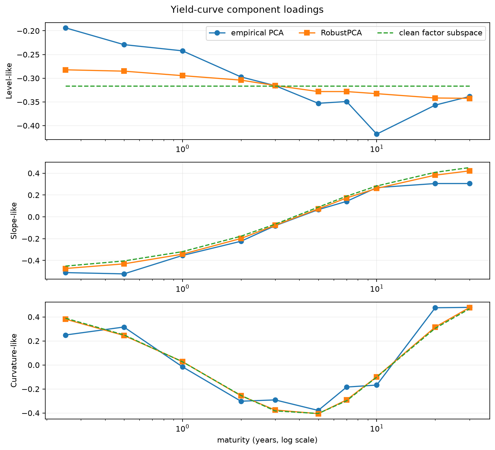
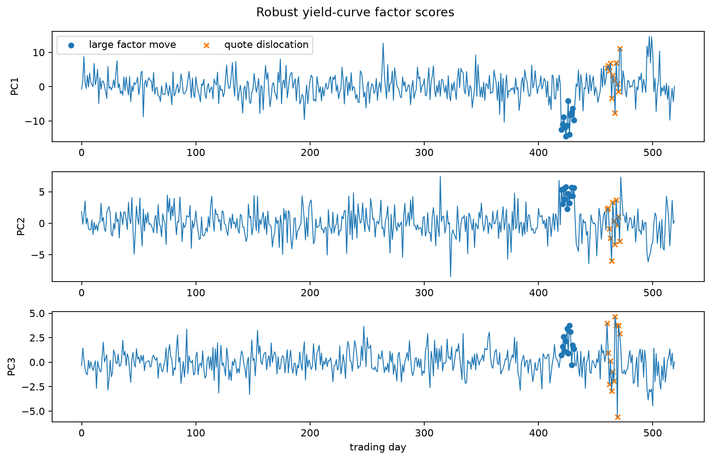
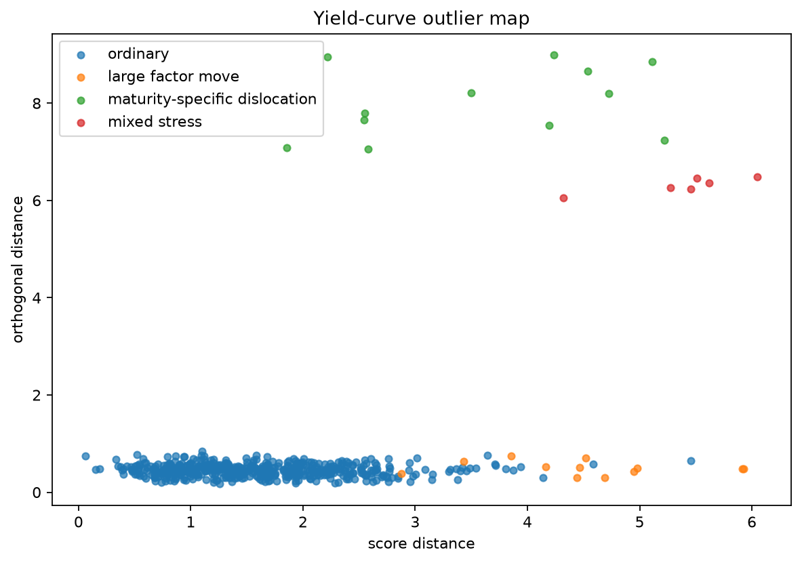

Robust level, slope, and curvature factors for the yield curve
===============================================================

A small number of factors usually explains most daily yield-curve movement.
Ordinary PCA works well on a clean history, but a few stale quotes or
maturity-specific spikes can rotate the components and make the factor model
harder to interpret.

Data used in the example
------------------------

Each row is a synthetic daily yield change and each column is a maturity from
three months to thirty years.  Clean observations are generated from
Nelson--Siegel-like level, slope, and curvature loadings.  The sample also
contains:

* large moves along the common factors;
* isolated quote errors at one or two maturities;
* days that combine a broad market move with a local dislocation.

The dimension is small relative to the sample size, and the contaminated days
are a minority, so the example uses ``FastMCD`` as the scatter estimator.

Reading the diagnostics
-----------------------

A day with high score distance but modest orthogonal distance is unusual in
size, yet still looks like a combination of the fitted level, slope, and
curvature factors.  A day with high orthogonal distance has a curve shape that
those factors do not explain.  In a real data pipeline, that would be a reason
to inspect quote quality, interpolation, and market events at the affected
maturities.

The loading plot also shows how contamination changes the empirical components.
The robust components stay closer to the known clean three-factor subspace.

Run the example
---------------

.. code-block:: bash

   python examples/plot_robust_pca_yield_curve.py

.. literalinclude:: ../_static/gallery/robust_pca_yield_curve/output.txt
   :language: text
   :caption: Console output

Factor loadings
---------------

Factor scores through time
--------------------------

Outlier map
-----------

Using real curve data
---------------------

A production version needs explicit choices for the source curve, interpolation
method, missing-quote policy, differencing horizon, and treatment of non-trading
days.  Thresholds should be backtested through several rate regimes.  This
example is a factor-diagnostic workflow, not a trading strategy.

Source
------

.. literalinclude:: ../../examples/plot_robust_pca_yield_curve.py
   :language: python
   :caption: examples/plot_robust_pca_yield_curve.py
