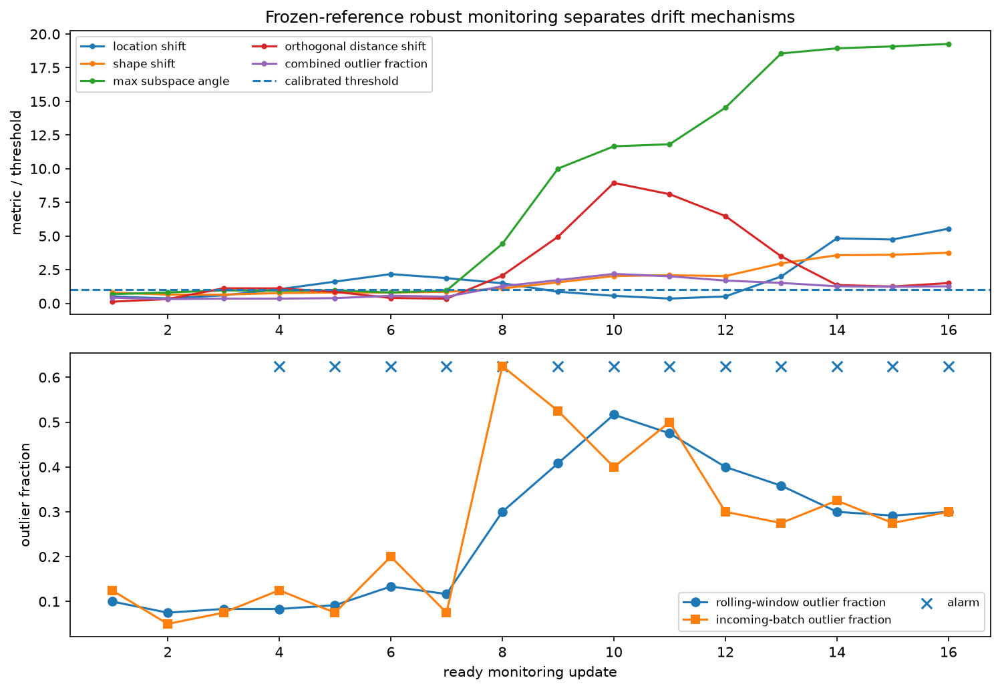
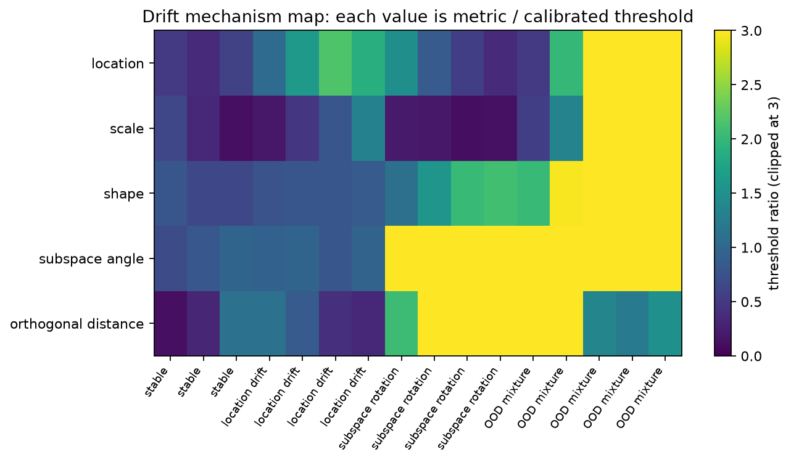
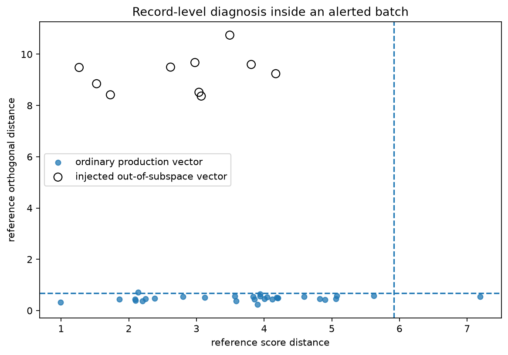

:orphan:

Following a changing embedding stream
=====================================

This example follows a sequence of embedding batches and compares each rolling
window with a fixed reference period.  The purpose is not only to raise an
alarm, but to show what changed: the center, overall scale, covariance shape,
principal subspace, or the fraction of unusual rows.

The four phases
---------------

The synthetic stream moves through four phases:

#. stable traffic drawn from the same process as the reference;
#. a shift along one of the known representation directions;
#. rotation of a latent factor into a direction that was orthogonal to the
   reference subspace;
#. a batch containing a minority of out-of-subspace corrupted vectors.

The monitor fits a robust reference once.  It scores each new batch against that
fixed model, then refits a separate model on the current rolling window.  This
order matters: production data cannot modify the baseline before it has been
checked.

Run the example
---------------

.. code-block:: bash

   python examples/plot_robust_subspace_monitoring.py

.. literalinclude:: ../_static/gallery/robust_subspace_monitoring/output.txt
   :language: text
   :caption: Console output

Monitoring history
------------------

Each curve in the upper panel is divided by its own calibrated threshold, so a
value of one marks the boundary.  Stable batches remain below it.  The
in-subspace shift mainly affects location and score-distance metrics, whereas
the rotated factor produces a much stronger subspace-angle and orthogonal
response.

The lower panel compares the outlier fraction in the complete rolling window
with the fraction in the newest batch.  The batch series reacts faster to the
final burst of corrupted vectors.

Which mechanism crossed its threshold?
--------------------------------------

The heat map gives a compact view of the normalized metrics for each update.  It
is useful after an alarm because different columns suggest different checks: a
center shift, a volatility change, a new correlation pattern, or a direction
outside the reference subspace.

Inspecting the final batch
--------------------------

Aggregate monitoring does not remove access to row-level diagnostics.  The
final outlier map plots reference score distance against reference orthogonal
distance for each vector in the alerted batch.

Deployment notes
----------------

Choose the reference and calibration periods from stable operation, and test the
false-alarm rate on a later stable period.  ``window_size`` controls the tradeoff
between responsiveness and stable covariance estimation.  The thresholds in
this example are empirical and are specific to the simulated stream.

Source
------

.. literalinclude:: ../../examples/plot_robust_subspace_monitoring.py
   :language: python
   :linenos:
