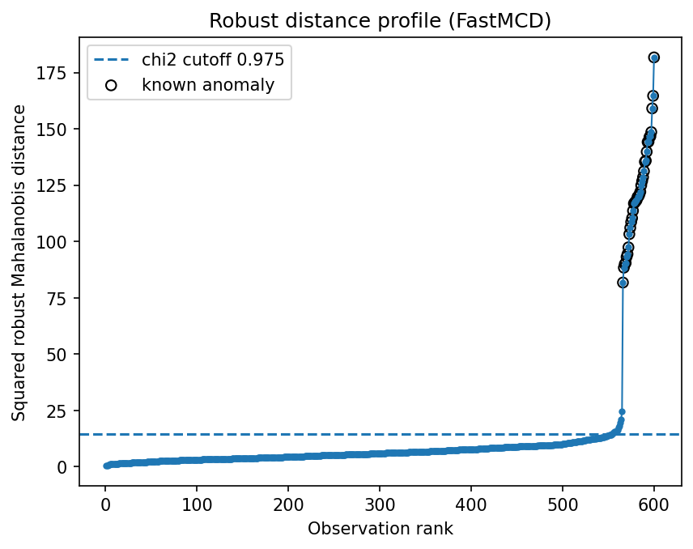
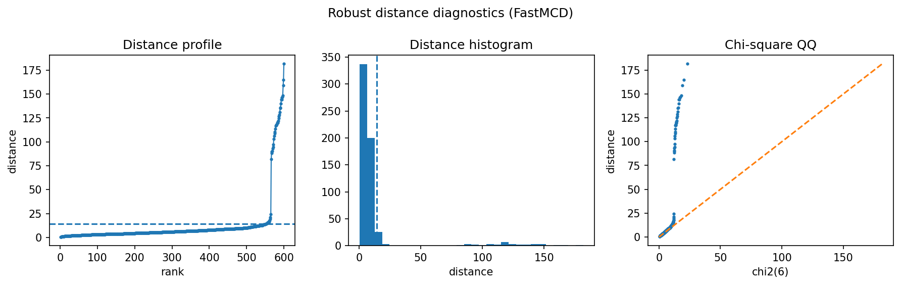

Sensor anomaly detection
========================

Sensor monitoring is a natural setting for robust distances: most observations describe normal operation, while faults appear as unusual multivariate combinations rather than single-channel spikes.

Result at a glance
------------------

FastMCD detects the injected sensor faults with precision and recall equal to 1.000 in this example.  The radial kurtosis is about 11.4, so the diagnostics also warn that Gaussian thresholds should be treated carefully.

What the data represent
-----------------------

The simulation creates several correlated sensor channels and injects abnormal operating points.  The abnormal rows are designed to be visible in the joint sensor geometry.

Why this estimator
------------------

``FastMCD`` is used because the normal operating regime is a single dominant cluster and faults are separated from that cluster.

Reproduce the result
--------------------

.. code-block:: bash

   python examples/use_case_sensor_anomaly.py

Output from the run
-------------------

.. literalinclude:: ../_static/gallery/sensor_anomaly/output.txt
   :language: text

Figures and diagnostics
-----------------------

How to read the result
----------------------

The distance panel is the main plot: normal observations should form a compact bulk, while faults appear above the robust threshold.  If the tail is gradual rather than separated, choose a threshold from operational review capacity rather than from a theoretical quantile.

What this does not prove
------------------------

In production, sensor drift and regime changes matter.  Refit or recalibrate on rolling windows and compare detected anomalies with maintenance logs.
