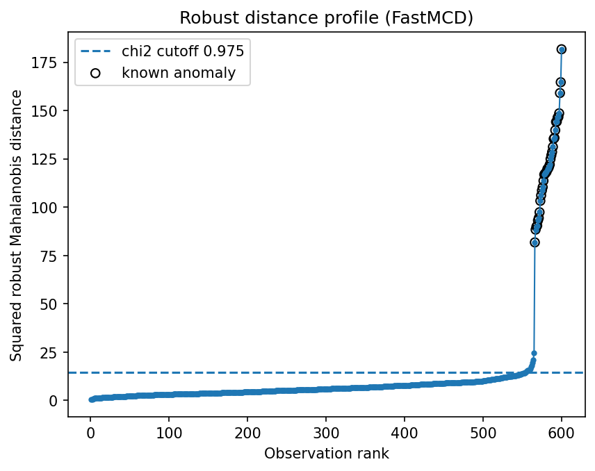
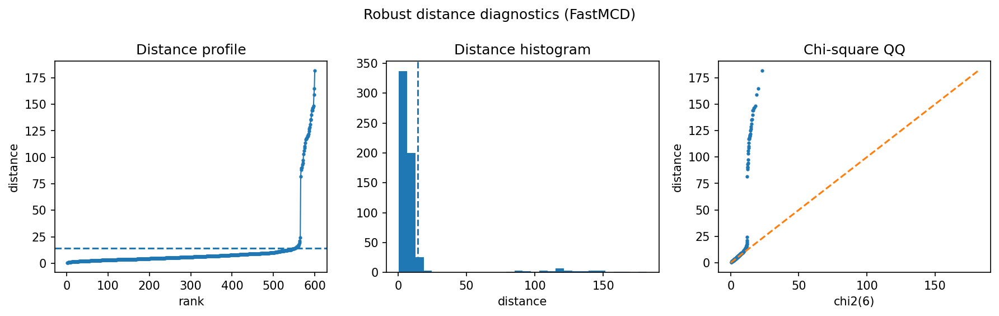

:orphan:

Sensor anomaly detection
========================

Sensor monitoring is a natural setting for robust distances: most observations describe normal operation, while faults appear as unusual multivariate combinations rather than single-channel spikes.

Detection result
----------------

All injected sensor faults are detected in this run.  Radial kurtosis is about 11.4, so the clean-looking separation should not be used to justify a Gaussian cutoff in a different dataset.

Correlated sensor simulation
----------------------------

The simulation creates several correlated sensor channels and injects abnormal operating points.  The abnormal rows are designed to be visible in the joint sensor geometry.

Single operating regime
-----------------------

``FastMCD`` is used because the normal operating regime is a single dominant cluster and faults are separated from that cluster.

Run the example
---------------

.. code-block:: bash

   python examples/use_case_sensor_anomaly.py

Console output
--------------

.. literalinclude:: ../_static/gallery/sensor_anomaly/output.txt
   :language: text

Distance diagnostics
--------------------

Thresholding the joint signal
-----------------------------

The distance panel is the main plot: normal observations should form a compact bulk, while faults appear above the robust threshold.  If the tail is gradual rather than separated, choose a threshold from operational review capacity rather than from a theoretical quantile.

Drift and recalibration
-----------------------

Production sensors drift and may have several legitimate operating modes.  Recalibrate on stable periods, segment known regimes, and compare alerts with maintenance records.
