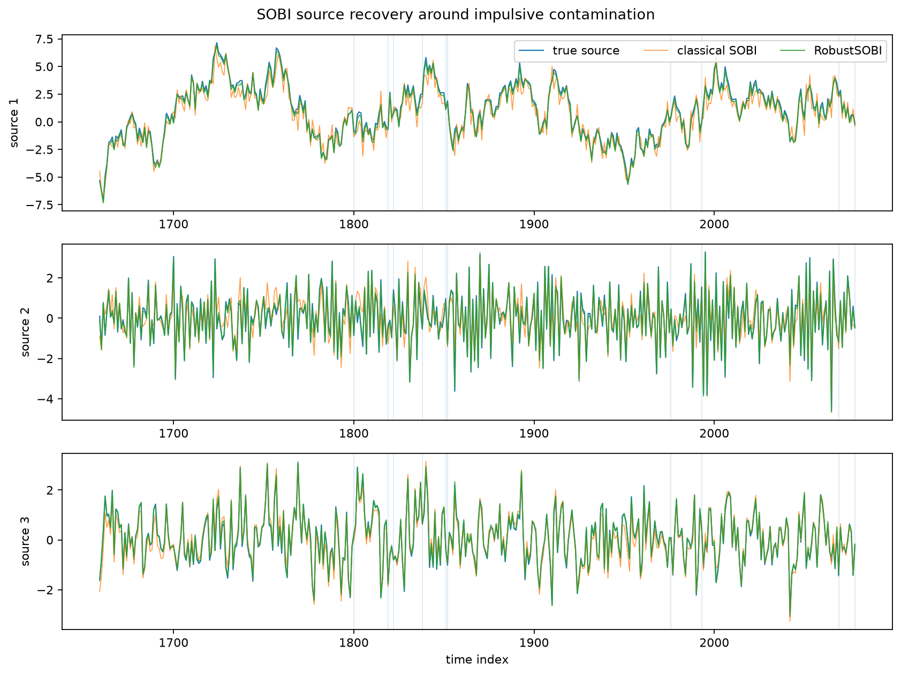
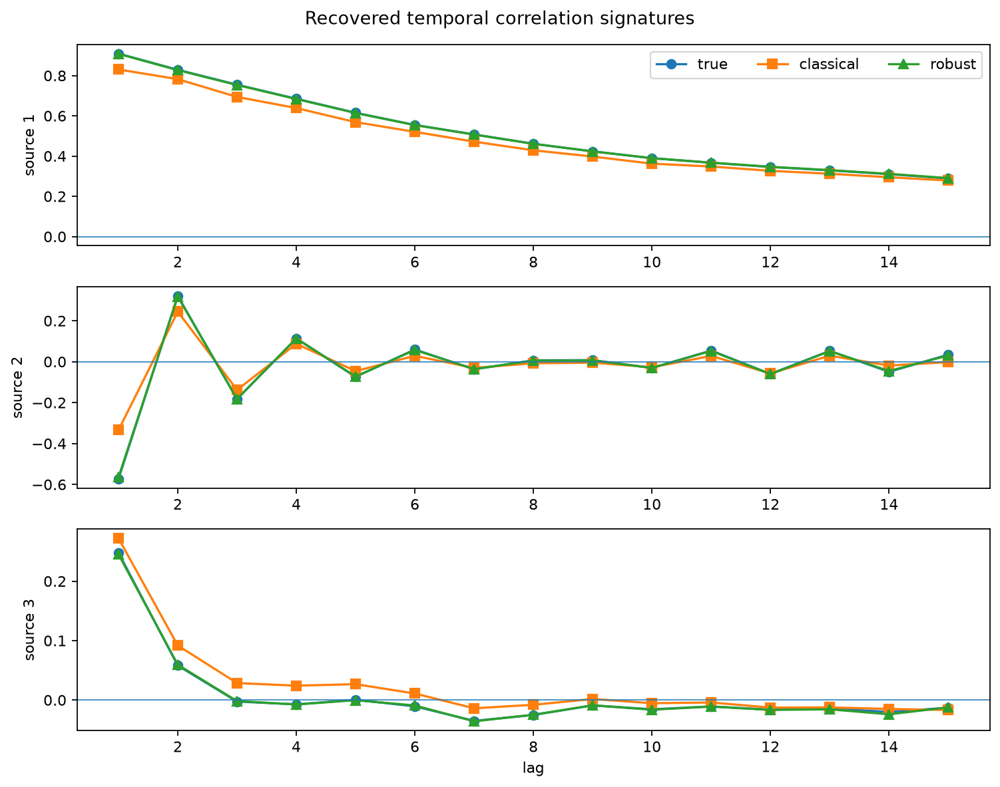
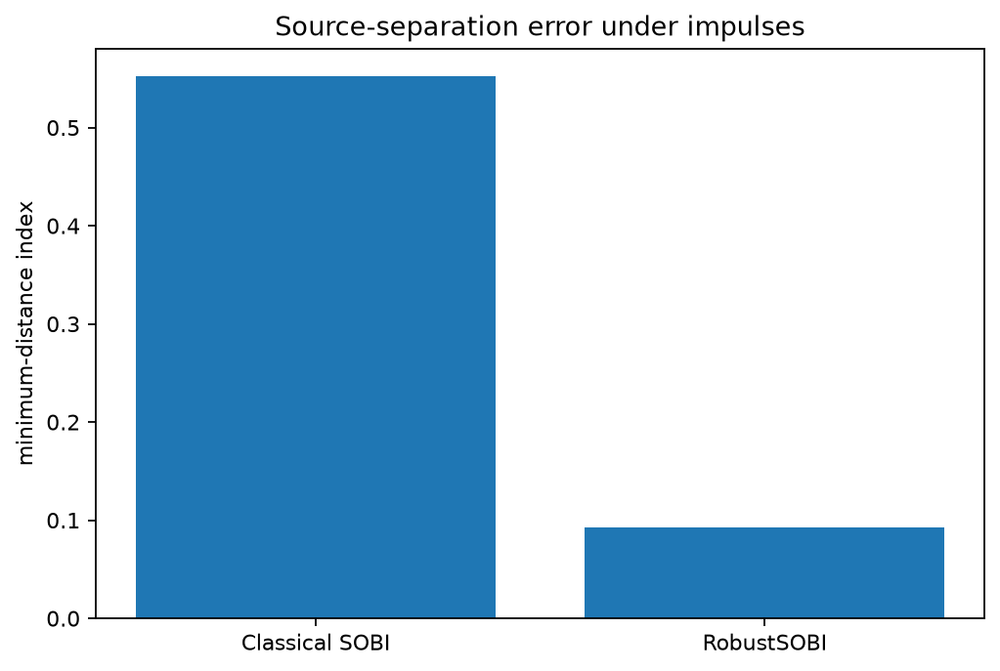

Robust SOBI for temporally correlated sources
==============================================

Second-order blind identification separates time series whose temporal
correlation signatures differ.  The example compares classical ``SOBI`` with
``RobustSOBI`` after adding isolated high-amplitude impulses to a mixed
multichannel signal.

Use this example when
---------------------

* the sources are time series rather than independent rows;
* sources have different autocorrelation patterns;
* the observations contain heavy tails or impulsive contamination;
* the mixture is instantaneous and real-valued.

Run the example
---------------

.. code-block:: bash

   python examples/sobi_source_separation.py

.. literalinclude:: ../_static/gallery/sobi_source_separation/output.txt
   :language: text
   :caption: Console output

Recovered time series
---------------------

Vertical markers identify impulse-contaminated time points in the displayed
window.  Robust whitening and weighted lag scatters preserve the latent source
shapes much more clearly than the classical fit.

Temporal signatures
-------------------

SOBI identifies components through their distinct lag-correlation patterns.
The robust estimates remain close to the true signatures after contamination.

Recovery error
--------------

The robust estimator combines robust whitening with Huber-weighted lagged
cross-scatter matrices.  The MDI comparison is the primary recovery diagnostic;
off-diagonal energy describes how well the fitted rotation jointly
diagonalizes the lag matrices.

Source
------

.. literalinclude:: ../../examples/sobi_source_separation.py
   :language: python
   :caption: examples/sobi_source_separation.py
