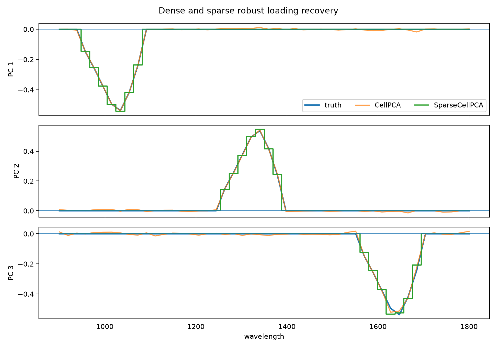
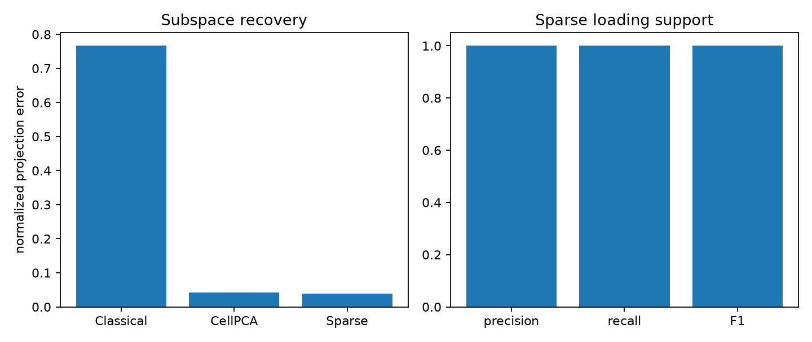
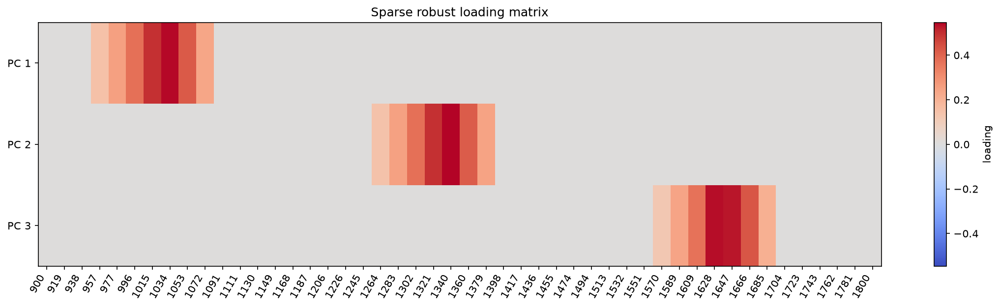
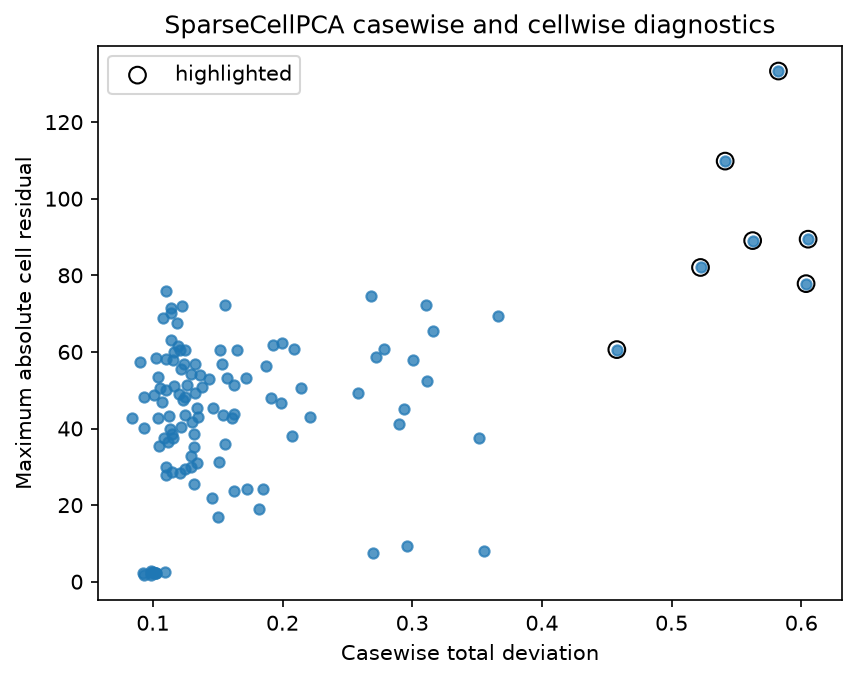

Sparse CellPCA for interpretable spectra
========================================

The simulated spectra contain three latent mechanisms, each active over a short
wavelength band.  The observed table also contains isolated bad readings,
several abnormal complete spectra, and missing cells.

Dense ``CellPCA`` is already robust to those defects.  ``SparseCellPCA`` adds a
loading penalty so that the fitted components identify the wavelengths that
carry each mechanism.

Run the example
---------------

.. code-block:: bash

   python examples/plot_sparse_cellpca_spectra.py

.. literalinclude:: ../_static/gallery/sparse_cellpca_spectra/output.txt
   :language: text
   :caption: Console output

Loading recovery
----------------

The sparse loading curves retain the clean subspace while removing small
coefficients outside the three active wavelength bands.

Subspace and support metrics
----------------------------

Projection error measures recovery of the three-dimensional subspace.  Support
precision and recall measure whether the nonzero loading entries identify the
wavelengths used to generate the clean factors.

Sparse loading matrix
---------------------

Exact zeros make the separation between the three wavelength bands visible
without choosing a display cutoff after fitting.

Outlier diagnostics
-------------------

Sparsity does not replace CellPCA's residual diagnostics.  The horizontal axis
summarizes broad rowwise departure, while the vertical axis records the largest
standardized cell residual.

Scope
-----

The example supplies the component count and penalty, and the true loading
support is known.  On real data the penalty should be checked against
reconstruction, stability, and domain interpretability.  Selecting fewer
variables is not useful if the resulting subspace is unstable or predictive
performance deteriorates.

Source
------

.. literalinclude:: ../../examples/plot_sparse_cellpca_spectra.py
   :language: python
   :caption: examples/plot_sparse_cellpca_spectra.py
