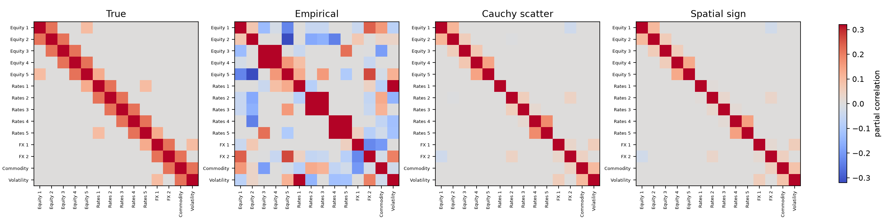
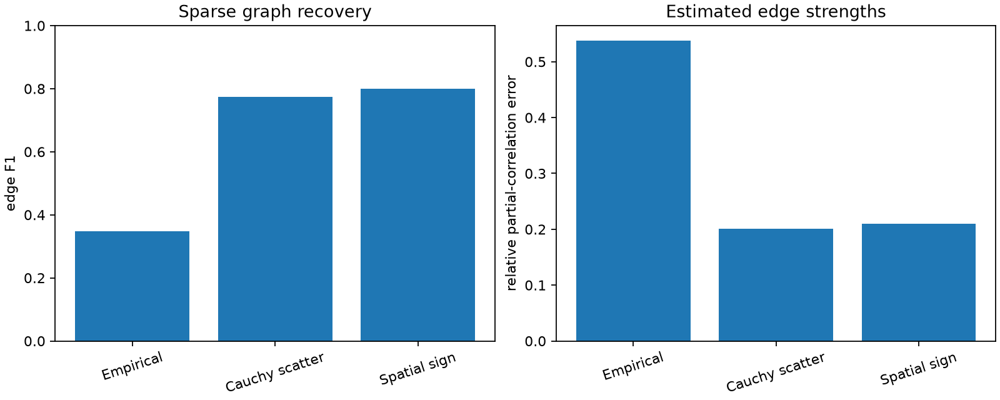
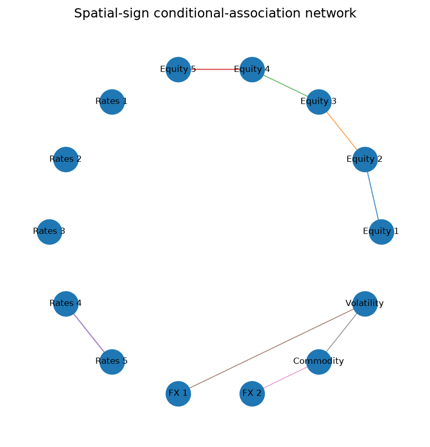
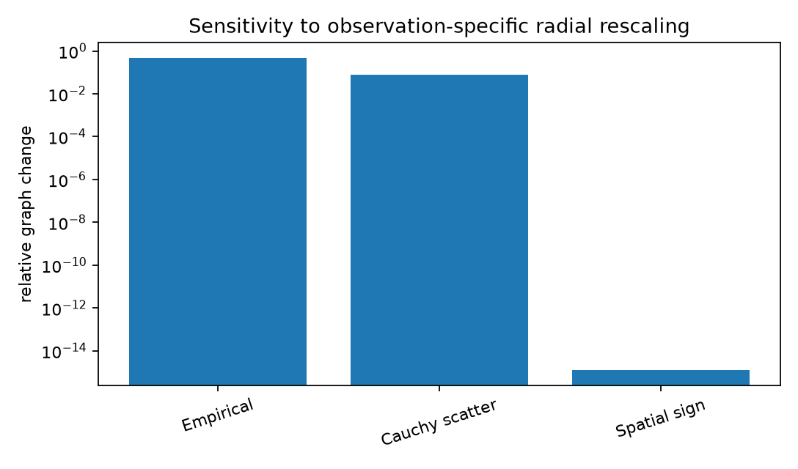

:orphan:

Spatial-sign graph under radial heavy tails
===========================================

This example uses a known sparse precision graph for fourteen synthetic market
variables.  The observations follow a very heavy-tailed elliptical model, and
additional rows receive large radial scale shocks.  Those shocks change the
length of a multivariate observation without changing its direction.

Three estimators use the same fixed sparsity penalty:

* empirical graphical lasso;
* graphical lasso applied to a regularized Cauchy scatter estimate;
* spatial-sign graphical lasso.

Run the example
---------------

.. code-block:: bash

   python examples/plot_spatial_sign_graphical_lasso.py

.. literalinclude:: ../_static/gallery/spatial_sign_graphical_lasso/output.txt
   :language: text
   :caption: Console output

Partial correlations
--------------------

The empirical graph contains many false edges because a few extreme radii
dominate the sample covariance.  Both robust fits are much closer to the true
conditional-association structure.  The spatial-sign fit is slightly sparser
in this simulation, while the Cauchy fit estimates the nonzero strengths a
little more accurately.

Graph recovery
--------------

The left panel reports edge F1.  The right panel compares the full partial-
correlation matrices, so it reflects both missed edges and coefficient error.

Network view
------------

The network shows the spatial-sign fit.  Edge width represents absolute partial
correlation.  Solid and dashed lines distinguish signs; they do not imply a
causal direction.

Radial rescaling
----------------

A second, symmetric sample is refitted after every positive/negative observation
pair is multiplied by an arbitrary positive radius.  The spatial signs are
unchanged, so the fitted spatial-sign graph changes only at floating-point
precision.  The empirical and Cauchy-scatter graphs retain some radial
sensitivity.

Scope
-----

This is the regime spatial signs are designed for: elliptical directions with
unreliable radii.  A corrupted individual coordinate changes the entire sign
vector, so this method is not a replacement for CellMCD-based graph estimation.
The estimated edges describe conditional uncorrelatedness under an elliptical
working model, not causal relations.

Source
------

.. literalinclude:: ../../examples/plot_spatial_sign_graphical_lasso.py
   :language: python
   :caption: examples/plot_spatial_sign_graphical_lasso.py
