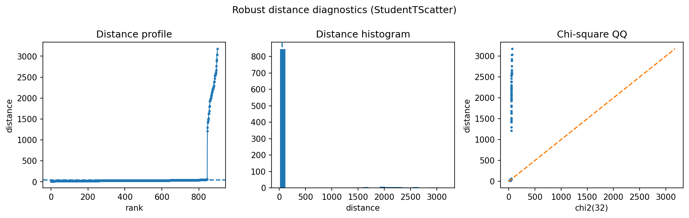

Text / embedding outlier screening
==================================

Embedding spaces often contain topical clusters and occasional off-topic documents.  Robust scatter estimators provide a simple way to rank unusual embeddings without training a supervised classifier.

Result at a glance
------------------

The example selects ``StudentTScatter`` and recovers all injected outlier embeddings in the lightweight simulation.  This makes a good entry point for document review, moderation, and search-quality diagnostics.

What the data represent
-----------------------

The data are synthetic embedding-like vectors: a central topic cloud plus a small group of off-topic points.  The goal is to mimic the geometry of sentence or document embeddings without requiring external models.

Why this estimator
------------------

``AutoRobustScatter`` chooses among robust scatter candidates.  Student-t scatter is often a good compromise for diffuse, heavy-tailed embedding clouds.

Reproduce the result
--------------------

.. code-block:: bash

   python examples/use_case_text_embedding_outliers.py

Output from the run
-------------------

.. literalinclude:: ../_static/gallery/text_embedding_outliers/output.txt
   :language: text

Figures and diagnostics
-----------------------

How to read the result
----------------------

Use the distance panel as a ranked review queue.  The top-scoring embeddings are candidates for off-topic or low-quality items; the threshold should usually be calibrated by review capacity.

What this does not prove
------------------------

Real embeddings can be strongly multimodal.  For multiple legitimate topics, prefer cluster-aware robust distances or segment the corpus before fitting.
