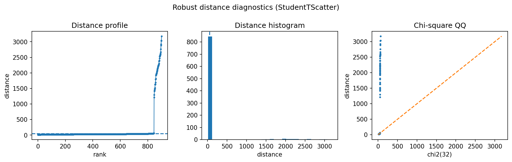

Text / embedding outlier screening
==================================

Embedding spaces often contain topical clusters and occasional off-topic documents.  Robust scatter estimators provide a simple way to rank unusual embeddings without training a supervised classifier.

Screening result
----------------

``AutoRobustScatter`` selects ``StudentTScatter`` and all injected off-topic vectors appear in the flagged set.  The ranked distances can be used as a document-review or search-quality queue.

Embedding simulation
--------------------

The data are synthetic embedding-like vectors: a central topic cloud plus a small group of off-topic points.  The goal is to mimic the geometry of sentence or document embeddings without requiring external models.

Automatic scatter selection
---------------------------

``AutoRobustScatter`` chooses among robust scatter candidates.  Student-t scatter is often a good compromise for diffuse, heavy-tailed embedding clouds.

Run the example
---------------

.. code-block:: bash

   python examples/use_case_text_embedding_outliers.py

Console output
--------------

.. literalinclude:: ../_static/gallery/text_embedding_outliers/output.txt
   :language: text

Distance panel
--------------

Building a review queue
-----------------------

Use the distance panel as a ranked review queue.  The top-scoring embeddings are candidates for off-topic or low-quality items; the threshold should usually be calibrated by review capacity.

Multiple topics and modes
-------------------------

A corpus with several legitimate topics rarely has one elliptical center.  Segment the corpus or use cluster-aware distances before treating large global distance as an error.
