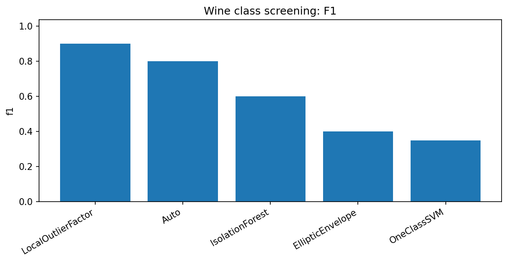
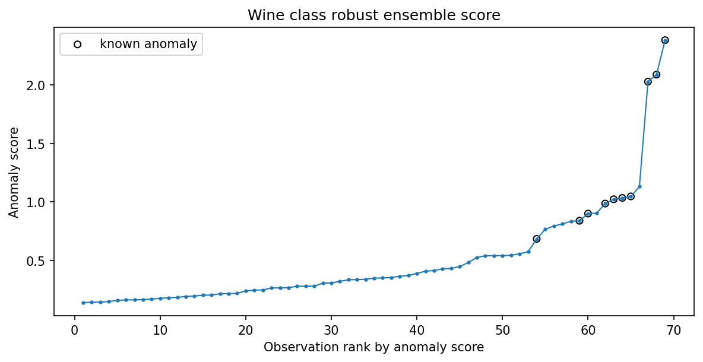
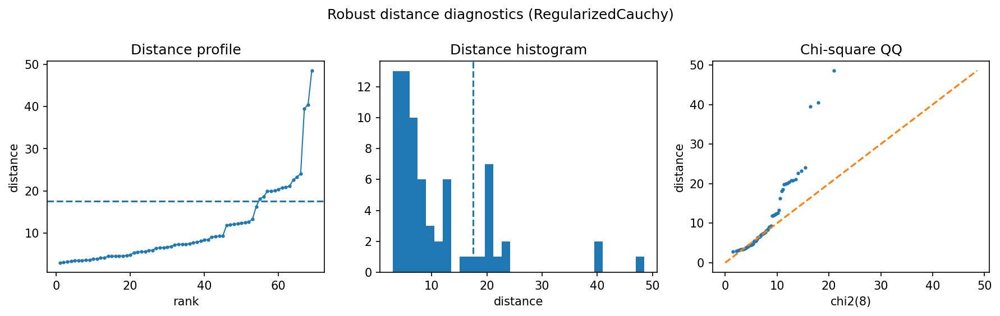

Wine class screening
====================

This small real dataset tests robustcov on a tabular problem where class structure is present but not necessarily covariance-shaped.

Result at a glance
------------------

LocalOutlierFactor is best in this run with F1=0.900.  robustcov Auto is second with F1=0.800 and strong ROC-AUC.  This is a good example of competitive but not dominant behavior.

What the data represent
-----------------------

The sklearn wine dataset is reduced to a one-class screening task: one class is treated as normal and another as anomalous.

Why this estimator
------------------

``AutoRobustScatter`` is used because the best robust scatter choice is not obvious in advance for this small real dataset.

Reproduce the result
--------------------

.. code-block:: bash

   python examples/use_case_wine_class_screening.py

Output from the run
-------------------

.. literalinclude:: ../_static/gallery/wine_class_screening/output.txt
   :language: text

Figures and diagnostics
-----------------------

How to read the result
----------------------

The baseline plot is the key figure.  It shows that robustcov is useful, but that local density can be better when class separation is more neighborhood-shaped than covariance-shaped.

What this does not prove
------------------------

This page is intentionally not a victory lap.  It shows how to compare robustcov fairly against familiar sklearn baselines.
