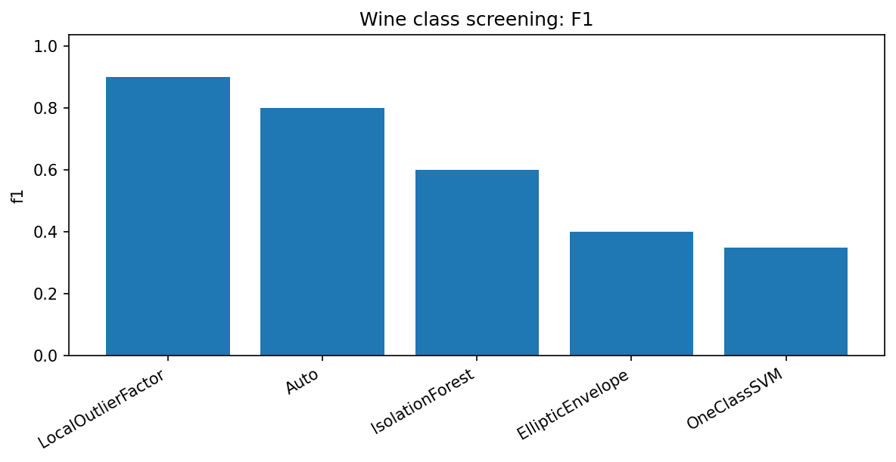
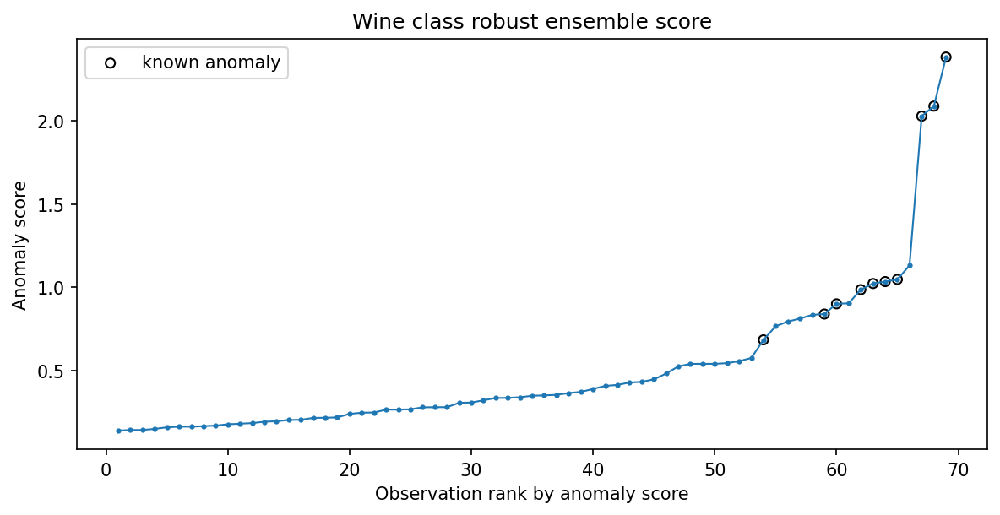
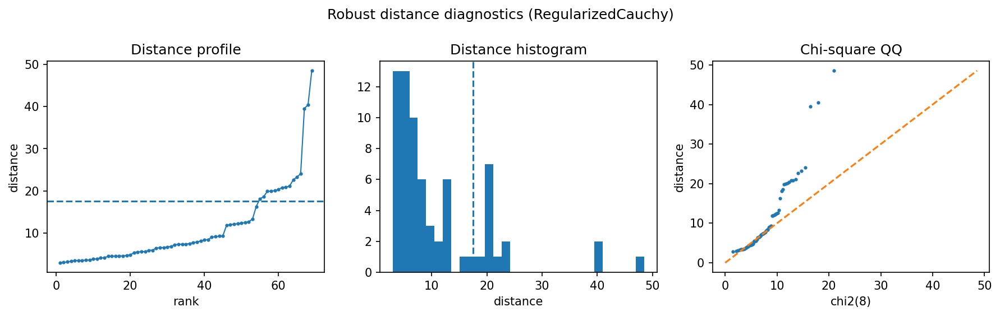

Wine class screening
====================

This small real dataset tests robustcov on a tabular problem where class structure is present but not necessarily covariance-shaped.

Benchmark result
----------------

LocalOutlierFactor has the highest F1 at 0.900.  ``AutoRobustScatter`` reaches 0.800 with a strong ROC-AUC, but local density is a better fit for this particular class boundary.

One-class wine task
-------------------

The sklearn wine dataset is reduced to a one-class screening task: one class is treated as normal and another as anomalous.

Automatic estimator selection
-----------------------------

``AutoRobustScatter`` is used because the best robust scatter choice is not obvious in advance for this small real dataset.

Run the comparison
------------------

.. code-block:: bash

   python examples/use_case_wine_class_screening.py

Console output
--------------

.. literalinclude:: ../_static/gallery/wine_class_screening/output.txt
   :language: text

Plots
-----

Where local density wins
------------------------

The baseline plot is the key figure.  It shows that robustcov is useful, but that local density can be better when class separation is more neighborhood-shaped than covariance-shaped.

Purpose of the comparison
-------------------------

The purpose of the page is comparison, not a claim that robust covariance is always the best detector.  Method choice should follow the geometry of the data and the operating metric.
