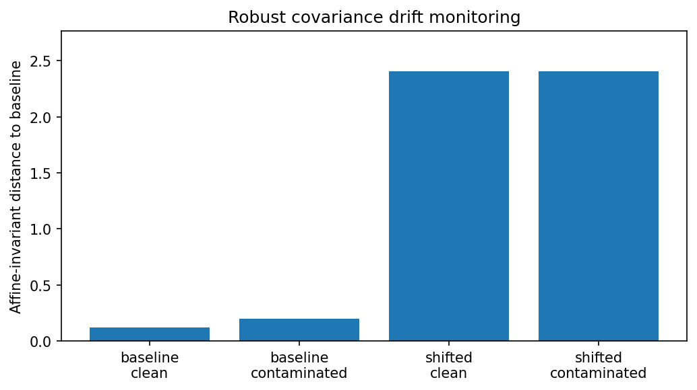
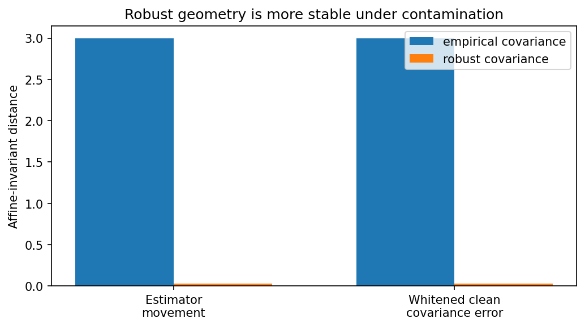

SPD geometry utilities
======================

``robustcov.geometry`` provides utilities for working with symmetric positive
definite covariance and scatter matrices. These functions are useful for robust
scatter diagnostics, Tyler-style shape estimators, covariance comparison,
covariance drift monitoring, and robust input geometry.

The module is intentionally utility-focused. It does not introduce a new
estimator family and does not prove convergence or optimality for every
regularized scatter estimator.

Core idea
---------

A fitted robust scatter estimator gives more than a covariance matrix. It defines
a geometry on the positive-definite cone and a robust geometry on the input
space.

The typical chain is:

.. code-block:: text

   robust scatter
        -> robust precision
        -> robust Mahalanobis distance
        -> robust similarity / kernel geometry

Information-geometry intuition
------------------------------

Covariance and scatter matrices are symmetric positive definite (SPD) matrices.
They do not naturally live in ordinary Euclidean space.  For example, taking a
straight-line average of two covariance matrices is easy algebraically, but it
does not always reflect the multiplicative way in which variances, correlations,
condition numbers, and eigenvalue ratios change.

The SPD cone has useful geometric structure.  In this geometry, two covariance
matrices are compared through transformations such as

.. math::

   A^{-1/2} B A^{-1/2},

which measures how matrix ``B`` looks in the coordinate system where matrix
``A`` has been whitened to the identity.  The affine-invariant distance used in
``robustcov.geometry`` is the Frobenius norm of the logarithm of this relative
matrix:

.. math::

   d_{\mathrm{AI}}(A, B)
   =
   \left\|
   \log\left(A^{-1/2} B A^{-1/2}\right)
   \right\|_F.

This distance depends on relative eigenvalue changes rather than raw coordinate
differences.  That makes it useful for comparing fitted covariance or scatter
matrices across time windows, datasets, preprocessing choices, or regularization
levels.

The log-Euclidean distance gives a simpler related view: map SPD matrices to
symmetric matrices with the matrix logarithm, compare them there, and map back
with the matrix exponential.  This is often convenient for diagnostics and
visualization.

Shape versus scale
~~~~~~~~~~~~~~~~~~

Tyler-style scatter estimators estimate *shape* rather than absolute scale.  If
``S`` is a Tyler shape estimate, then multiplying ``S`` by a positive constant
describes the same shape.  A normalization convention is therefore needed.

``robustcov.geometry`` provides both common conventions:

.. code-block:: python

   S_trace = rcg.trace_normalize(S)
   S_det = rcg.det_normalize(S)

Trace normalization fixes ``trace(S) = p``.  Determinant normalization fixes
``det(S) = 1``.  Both are useful ways to choose a representative from the same
scale-equivalence class.

From robust scatter to robust similarity
~~~~~~~~~~~~~~~~~~~~~~~~~~~~~~~~~~~~~~~~

A robust scatter estimate also defines input-space geometry.  Its inverse
scatter matrix gives a robust Mahalanobis distance,

.. math::

   d_R^2(x, y)
   =
   (x-y)^\top \widehat{\Sigma}_R^{-1} (x-y).

This distance can be converted into a similarity function,

.. math::

   k_R(x, y)
   =
   \exp\!\left[
   -{d_R^2(x, y) \over 2\ell^2}
   \right].

This is the geometric idea behind the robust kernel utilities in ``robustcov``:
robust scatter gives robust distance, and robust distance gives robust
similarity.

What robustcov provides
~~~~~~~~~~~~~~~~~~~~~~~

``robustcov.geometry`` is not a full information-geometry framework.  It provides
a small set of practical utilities that support robust covariance workflows:

* SPD matrix functions: ``spd_log``, ``spd_exp``, and ``spd_power``;
* SPD distances: ``affine_invariant_distance`` and ``logeuclidean_distance``;
* affine-invariant geodesics: ``spd_geodesic``;
* shape normalization: ``trace_normalize`` and ``det_normalize``;
* Tyler diagnostics: ``tyler_objective`` and
  ``tyler_fixed_point_residual``.

These tools make robust scatter estimates easier to compare, diagnose, and use
as geometry in downstream ML tasks.

Tyler estimator as information geometry
---------------------------------------

Tyler's shape estimator has a natural geometric interpretation.  It estimates a
scatter *shape* rather than an absolute covariance scale.  In other words,
``S`` and ``c * S`` represent the same Tyler shape for any positive scalar
``c``.  The natural parameter space is therefore not the full SPD cone, but the
SPD cone modulo positive rescaling.

For centered observations ``z_i``, Tyler's estimator depends on the directions
of the data through quadratic forms

.. math::

   z_i^\top S^{-1} z_i.

The corresponding scale-invariant objective, up to constants, is

.. math::

   L(S)
   =
   \log \det(S)
   +
   {p \over n}
   \sum_{i=1}^{n}
   \log\left(z_i^\top S^{-1} z_i\right).

This objective is unchanged if ``S`` is replaced by ``c * S``.  The term
``log det(S)`` expands or contracts volume, while the logarithmic quadratic
terms measure how the observed directions look under the inverse shape matrix.

This is the same geometry that appears in the angular central Gaussian view of
Tyler's estimator: after centering, the radial lengths of observations are
discarded and the estimator fits the directional shape of the data.  The result
is robust to heavy tails because unusually large radii do not dominate the fit
in the same way they dominate empirical covariance.

The fixed-point equation

.. math::

   S
   =
   {p \over n}
   \sum_{i=1}^{n}
   {z_i z_i^\top \over z_i^\top S^{-1} z_i}

can be read geometrically as a balance condition.  Each observation contributes
a rank-one direction ``z_i z_i.T``, but its contribution is weighted by the
inverse robust squared length under the current shape.  Directions that are
already long under ``S`` receive smaller weight; directions that are short under
``S`` receive larger weight.

Because the estimator is scale-invariant, a normalization convention is needed.
For example, robustcov uses utilities such as

.. code-block:: python

   S_trace = rcg.trace_normalize(S)
   S_det = rcg.det_normalize(S)

to choose a representative from the same scale-equivalence class.

In ``robustcov.geometry``, this viewpoint appears directly in two diagnostic
functions:

.. code-block:: python

   obj = rcg.tyler_objective(S, X)
   resid = rcg.tyler_fixed_point_residual(S, X)

``tyler_objective`` evaluates the scale-invariant Tyler objective, while
``tyler_fixed_point_residual`` measures how close a shape matrix is to the
normalized Tyler fixed-point update for a given dataset.

These functions do not make ``robustcov`` a full information-geometry package.
They expose the part of the geometry that is useful for robust covariance
workflows: shape normalization, SPD distances, geodesics, and Tyler fixed-point
diagnostics.

Basic usage
-----------

.. code-block:: python

   import robustcov as rc
   import robustcov.geometry as rcg

   est = rc.TylerShape().fit(X)

   resid = rcg.tyler_fixed_point_residual(est.covariance_, X)
   S_det = rcg.det_normalize(est.covariance_)

Distances on the SPD cone
-------------------------

.. code-block:: python

   d_airm = rcg.affine_invariant_distance(S1, S2)
   d_log = rcg.logeuclidean_distance(S1, S2)

The affine-invariant distance is

.. math::

   d(A, B) =
   \left\|
   \log\left(A^{-1/2} B A^{-1/2}\right)
   \right\|_F.

The log-Euclidean distance is

.. math::

   d(A, B) =
   \left\|
   \log(A) - \log(B)
   \right\|_F.

Tyler fixed-point diagnostics
-----------------------------

For centered observations :math:`z_i`, the Tyler shape fixed-point update is

.. math::

   T(S) =
   \frac{p}{n}
   \sum_{i=1}^{n}
   \frac{z_i z_i^\top}{z_i^\top S^{-1} z_i}.

``tyler_fixed_point_residual`` reports the Frobenius distance between the
normalized update and the current shape matrix. It is a diagnostic utility, not
a formal proof of convergence for all estimator variants.

Modern ML similarity patterns
-----------------------------

For a complete executable retrieval example, see
:doc:`gallery/embedding_reranking_robust_geometry`, which shows robust
Mahalanobis reranking for a RAG-style embedding retrieval workflow.

Many modern ML systems are built around similarity scores: nearest-neighbor
retrieval, reranking, attention weights, kernel methods, and embedding search.
The default geometry is often Euclidean distance or cosine similarity. Those
choices can work well, but they may be sensitive to anisotropic coordinates,
heavy-tailed directions, sensor faults, or leverage-like embedding dimensions.

A robust scatter estimate gives an alternative geometry. If
``precision = inverse(scatter)``, then a robust squared distance is

.. math::

   d_R^2(x, y)
   =
   (x-y)^\top \widehat{\Sigma}_R^{-1} (x-y).

This distance can be used directly for ranking or converted into a similarity:

.. code-block:: python

   delta = x - y
   d2 = delta @ precision @ delta
   score = np.exp(-0.5 * d2 / length_scale**2)

The examples below are patterns, not complete models. They show where robust
geometry can be inserted into existing ML workflows.

Embedding retrieval and RAG reranking
~~~~~~~~~~~~~~~~~~~~~~~~~~~~~~~~~~~~~

In retrieval-augmented generation or embedding search, candidates are often
ranked by cosine or Euclidean similarity. If embeddings contain leverage-like
directions, a few coordinates can dominate the ranking.

Robust Mahalanobis geometry can be used as a second-stage reranker:

.. code-block:: python

   fit = rc.FastMCD(contamination=0.05).fit(reference_embeddings)
   precision = fit.precision_

   def robust_distance(query, candidate):
       delta = query - candidate
       return np.sqrt(delta @ precision @ delta)

   reranked = sorted(candidates, key=lambda c: robust_distance(query, c))

This does not replace semantic embedding models. Instead, it adds a robust
geometry layer that can reduce the influence of atypical directions in the
embedding space.

Attention over sensor windows
~~~~~~~~~~~~~~~~~~~~~~~~~~~~~

Attention mechanisms compare query and key vectors. In sensor or industrial
monitoring, some windows may contain faults, spikes, or contaminated directions.
A robust covariance estimate over normal windows can define a more stable
similarity between query and key windows:

.. code-block:: python

   fit = rc.FastMCD(contamination=0.08).fit(normal_window_features)
   precision = fit.precision_

   def robust_attention_score(query, key):
       delta = query - key
       return -0.5 * delta @ precision @ delta

The resulting score can be used as a diagnostic attention-like weight or as a
robust similarity feature. This is useful when raw dot products are too sensitive
to faulty sensor directions.

Finance and event matching
~~~~~~~~~~~~~~~~~~~~~~~~~~

Market states are often heavy-tailed. Event matching based on raw Euclidean
distance can be distorted by shocks in a few assets or factors. Robust scatter
can define a geometry for comparing market states while reducing the effect of
heavy-tail leverage:

.. code-block:: python

   fit = rc.StudentTScatter(df=4).fit(market_state_features)
   precision = fit.precision_

   def state_distance(today, historical_day):
       delta = today - historical_day
       return np.sqrt(delta @ precision @ delta)

This can support tasks such as finding historical analogues, comparing volatility
regimes, or constructing robust event-neighbor features.

Multimodal embeddings
~~~~~~~~~~~~~~~~~~~~~

Image, text, audio, and multimodal embeddings are often anisotropic: some
directions carry much larger variance than others. Robust whitening or robust
precision can make similarity less dominated by a small number of directions:

.. code-block:: python

   fit = rc.RegularizedTyler(alpha=0.10).fit(embeddings)
   W = rcg.spd_power(fit.covariance_, -0.5)

   embeddings_white = embeddings @ W.T
   query_white = query @ W.T

After robust whitening, ordinary cosine or Euclidean similarity can be computed
in the transformed space. This gives a practical bridge between robust covariance
estimation and embedding-based ML workflows.

Practical notes
~~~~~~~~~~~~~~~

These patterns are most useful when the feature space is moderately sized and
there are enough reference samples to estimate scatter. In higher-dimensional
embedding spaces, prefer regularized estimators, dimensionality reduction, or
domain-specific validation. Robust geometry should be treated as a geometry
layer that improves ranking or similarity diagnostics, not as a replacement for
task-level evaluation.

Geometry example gallery
------------------------

Example 1: Tyler fixed-point diagnostics
~~~~~~~~~~~~~~~~~~~~~~~~~~~~~~~~~~~~~~~~

This example compares two robust scatter estimates, normalizes shape matrices,
computes distances on the SPD cone, and evaluates Tyler fixed-point residuals
along the affine-invariant geodesic between two scatter matrices.

Run it with:

.. code-block:: bash

   python examples/spd_geometry_diagnostics.py

Output:

.. literalinclude:: _static/examples/spd_geometry_diagnostics_output.txt
   :language: text

Interpretation:

The Tyler estimate fitted on ``X1`` has a near-zero fixed-point residual on
``X1``. As the geodesic moves from ``S1`` toward the different scatter matrix
``S2``, the affine-invariant distance from ``S1`` increases and the Tyler
residual on ``X1`` increases. This illustrates how SPD geometry can be used to
compare robust scatter estimates and inspect whether a shape matrix is close to
the Tyler fixed-point equation for a given dataset.

Source excerpt:

.. literalinclude:: ../examples/spd_geometry_diagnostics.py
   :language: python
   :start-after: def main():
   :end-before: if __name__ == "__main__":
   :dedent: 4

Example 2: ML use-case patterns
~~~~~~~~~~~~~~~~~~~~~~~~~~~~~~~

This example shows seven practical ML patterns:

* covariance or regime drift monitoring across feature windows;
* comparing empirical and robust scatter under contamination;
* estimator stability under the same contaminated inputs;
* robust similarity induced by robust scatter;
* regularization-path diagnostics for Tyler-style scatter estimates;
* robust whitening for preprocessing;
* robust nearest-neighbor or embedding retrieval geometry.

Run it with:

.. code-block:: bash

   python examples/spd_geometry_ml_use_cases.py

Output:

.. literalinclude:: _static/examples/spd_geometry_ml_use_cases_output.txt
   :language: text

Interpretation:

Baseline windows remain close to the reference scatter, while shifted windows
have much larger affine-invariant distance. The empirical covariance is visibly
inflated in the contaminated direction compared with the robust covariance.
When the same clean sample is corrupted, the empirical covariance moves much
farther on the SPD cone than the robust covariance. The robust similarity is
high for a nearby point and essentially zero for a leverage-like point. The
regularization-path table shows how SPD distances, condition numbers, and
fixed-point residuals can be used to inspect Tyler-style regularized scatter
estimates. The whitening example shows that preprocessing based on contaminated
empirical covariance can distort the clean inlier geometry, while robust
whitening stays closer to the intended identity covariance. The nearest-neighbor
example shows how robust Mahalanobis geometry can distinguish ordinary nearby
points from leverage-like points more clearly than raw Euclidean distance.

Visual diagnostics:

The first plot shows that covariance geometry changes little across baseline
windows but changes strongly under a true shifted regime. The second plot shows
that empirical covariance moves much farther under contamination and gives a
worse whitening map for the clean inlier geometry.

Covariance drift monitoring
^^^^^^^^^^^^^^^^^^^^^^^^^^^

Fit a robust scatter estimate on a baseline feature window and compare later
windows by affine-invariant distance:

.. code-block:: python

   import robustcov as rc
   import robustcov.geometry as rcg

   S_ref = rc.FastMCD(contamination=0.08).fit(X_baseline).covariance_
   S_now = rc.FastMCD(contamination=0.08).fit(X_current).covariance_

   drift_score = rcg.affine_invariant_distance(S_ref, S_now)

This gives a scalar drift score for changes in feature covariance geometry. It
is useful for monitoring sensor data, embedding distributions, finance windows,
or tabular ML features.

Empirical versus robust scatter
^^^^^^^^^^^^^^^^^^^^^^^^^^^^^^^

Under contamination, empirical covariance can inflate along leverage directions:

.. code-block:: python

   S_emp = np.cov(X, rowvar=False)
   S_rob = rc.FastMCD(contamination=0.1).fit(X).covariance_

   disagreement = rcg.affine_invariant_distance(S_emp, S_rob)

A large disagreement suggests that empirical covariance geometry may be strongly
affected by outliers or leverage points.

Estimator stability
^^^^^^^^^^^^^^^^^^^

Geometry also gives a coordinate-aware way to compare how much an estimator
moves after contamination. Fit empirical and robust scatter estimates on a clean
sample and on the same sample after adding leverage points:

.. code-block:: python

   d_emp = rcg.affine_invariant_distance(S_emp_clean, S_emp_corrupted)
   d_rob = rcg.affine_invariant_distance(S_rob_clean, S_rob_corrupted)

If ``d_emp`` is much larger than ``d_rob``, the empirical covariance geometry is
more sensitive to the contamination.

Regularization-path diagnostics
^^^^^^^^^^^^^^^^^^^^^^^^^^^^^^^

For Tyler-style estimators, SPD distances can summarize how regularization
changes the fitted scatter matrix:

.. code-block:: python

   S_ref = rc.TylerShape(assume_centered=True).fit(X).covariance_

   for alpha in alphas:
       est = rc.RegularizedTyler(alpha=alpha, assume_centered=True).fit(X)
       d = rcg.affine_invariant_distance(S_ref, est.covariance_)
       cond = np.linalg.cond(est.covariance_)

This helps inspect the tradeoff between staying close to an unregularized shape
estimate and improving numerical conditioning. The Tyler fixed-point residual is
reported as a diagnostic quantity, not as a formal optimality certificate for
regularized objectives.

Robust similarity
^^^^^^^^^^^^^^^^^

A robust scatter estimate also induces a robust similarity function. If
``precision`` is the inverse robust covariance matrix, then

.. math::

   k_R(x, y) =
   \exp\!\left[
   -{(x-y)^\top \widehat{\Sigma}_R^{-1} (x-y) \over 2\ell^2}
   \right].

This is the same idea used by the robust GP/kernel metric utilities: robust
scatter defines robust distance, and robust distance defines robust similarity.

Robust whitening for preprocessing
^^^^^^^^^^^^^^^^^^^^^^^^^^^^^^^^^^

Covariance estimates are often used to whiten or standardize features before
downstream modeling. If the covariance estimate is contaminated, the whitening
map can distort the clean inlier geometry:

.. code-block:: python

   W_emp = rcg.spd_power(S_emp_contaminated, -0.5)
   W_rob = rcg.spd_power(S_rob_contaminated, -0.5)

   X_emp_white = X_clean @ W_emp.T
   X_rob_white = X_clean @ W_rob.T

   d_emp = rcg.affine_invariant_distance(np.eye(p), np.cov(X_emp_white, rowvar=False))
   d_rob = rcg.affine_invariant_distance(np.eye(p), np.cov(X_rob_white, rowvar=False))

A smaller distance to the identity matrix means the clean inliers are closer to
the intended whitened geometry.

Robust nearest-neighbor geometry
^^^^^^^^^^^^^^^^^^^^^^^^^^^^^^^^

In embedding or retrieval workflows, raw Euclidean distances may not reflect the
robust feature geometry. A robust precision matrix defines a Mahalanobis
distance:

.. code-block:: python

   delta = query - candidate
   robust_distance = np.sqrt(delta @ precision @ delta)

This can help distinguish ordinary nearby points from leverage-like points in
directions that are atypical under the robust scatter estimate.

Source excerpt:

.. literalinclude:: ../examples/spd_geometry_ml_use_cases.py
   :language: python
   :start-after: def main():
   :end-before: if __name__ == "__main__":
   :dedent: 4
